# Antigravity 2.0 と MCP でゲストハウス予約システムを作って Cloud Run に公開しよう

〜 DevFest Sapporo 2026 : WorkShop「Antigravity 2.0 の章」（13:00 - 14:50）〜

講師 : あんざいゆき ( https://x.com/yanzm )

普段は Android アプリを開発するお仕事をしています。最近は AI に個人開発アプリの実装を手伝ってもらったり、自分用の便利ツールを作ってもらったりしてます。めっちゃ楽しいです。

<span style="color:salmon"><b>※ このドキュメントは 2026/09 時点の Antigravity 2.0 で検証した内容です。Antigravity は活発にアップデートされているため、画面が異なる場合は最新の公式ドキュメント ( https://antigravity.google/docs ) を確認してください。</b></span>

## 今日 1 日の流れ

| 時間 | 内容 | 担当 |
| --- | --- | --- |
| 11:05 - 11:40 | WorkShop **Cloud の章** : Google Cloud 導入部レクチャー | sinmetal さん |
| 11:40 - 12:00 | 導入作業（**Google Cloud のセットアップを講師と一緒に**。[setup-gcp.md](setup-gcp.md)） | 全員 |
| 12:00 - 13:00 | お昼休憩 | |
| **13:00 - 14:50** | **WorkShop Antigravity 2.0 の章 : アプリ作成 & ビルド** ← このドキュメント | あんざい |
| 15:00 - 16:30 | WorkShop **アッセンブルの章** : Cloud Run + Cloud 制御（運用） | sinmetal さん・yoichiro さん |
| 16:30 - 16:50 | 発表・クロージング | |

## このセッションの目標

**全員で同じ「ゲストハウスの宿泊予約システム」を作り、Cloud Run に公開するところまで**を、Antigravity 2.0 のエージェントに任せて体験します。

前回のワークショップと違うのは 2 点です。

- **データベース（Firestore）を使う** : 予約が保存される「本物のシステム」です。15:00 のパートでこのシステムを「運用」します
- **MCP を使う** : エージェントが Firestore のデータを直接読み書きしたり、Cloud Run にそのままデプロイしたりします。zip をアップロードして Cloud Shell で叩く、といった作業はもうありません

あなたの役割は前回と同じ **「開発のディレクター」** です。細かい実装はエージェントに任せて、承認ダイアログを読み、動くものを確認し、次の指示を出していきましょう。

## Antigravity 2.0 とは

[Antigravity](https://antigravity.google/) は Google が提供するエージェント型開発プラットフォームです。2026 年 6 月の 2.0 で、**Antigravity 2.0**（エージェントを動かすデスクトップアプリ）と **Antigravity IDE**（従来の VS Code ベースのエディタ）の 2 つのアプリに分かれました。

今日は **Antigravity 2.0** を主に使います。ファイルツリーやエディタはなく、会話とエージェントの作業パネルだけのシンプルな画面ですが、ターミナルは内蔵されています。ファイルを自分で作ったり直したりするとき（ステップ 0 のルール作成）は、右上の **Open IDE** から **Antigravity IDE** で同じフォルダを開きます。2 つのアプリはログインが別なので、両方とも事前にログインしておいてください。

詳しくは [Antigravity 2.0 ガイド](antigravity-guide.md) を参照してください。

## 事前準備の確認

以下がすべて済んでいるか確認してください。<span style="color:salmon"><b>まだの方は手をあげて教えてください！</b></span>

**事前準備（connpass に記載）**

- [ ] **Antigravity 2.0** と **Antigravity IDE** の両方がインストールされ、それぞれ個人の Google アカウントでログインできている
- [ ] gcloud CLI がインストールされている
- [ ] Node.js が **22.23.1 以降 または 24.18 以降**（`node -v` で確認。<span style="color:salmon">22.23.0 と 24.17.0 は NG</span>）

**午前の「Cloud の章」で、講師と一緒に自分の手でやったもの**（[setup-gcp.md](setup-gcp.md)）

- [ ] `gcloud auth login` と `gcloud auth application-default login` の両方を実行した
- [ ] Google Cloud プロジェクトを作成し、課金アカウントにリンクした
- [ ] Firestore データベースを作成した（Native mode / asia-northeast1 / `(default)`）
- [ ] 自分のアカウントに `roles/mcp.toolUser` と `roles/datastore.user` を付与した

ターミナルで以下を実行して、エラーにならなければ準備完了です。

```
node -v
gcloud auth application-default print-access-token
gcloud config get-value project
```

最後のコマンドで表示される **プロジェクト ID** は、このあと何度も使うのでメモしておいてください。

> **Note** : Node.js のバージョンが 22.23.0 または 24.17.0 だった場合、ステップ 5 のデプロイが必ず失敗します（Node 本体の不具合です）。今のうちに新しいバージョンに更新してください。

## ステップ 0 : プロジェクトを作ってルールを置く（目安 : 10 分）

### プロジェクトフォルダを作る

Antigravity 2.0 を起動し、左の **Projects** の横にある **+** ボタンから、新しくこのアプリ用のフォルダを作って開きます。

<span style="color:salmon"><b>フォルダは `~/Projects/guesthouse-app` のように、他のファイルがない独立した場所に作ってください。</b></span> 親フォルダに関係ないファイルがあると、エージェントがそれを読みに行ってしまいます。

### ワークスペースルールを置く

エージェントの動作を制御する **ルール** を配置します。今日の作業で「やってほしくないこと」（余計なテストを書く、勝手に初期データを入れる、エラーのたびに認証情報を探し回る…）を先に伝えておくためのものです。

ルールは、プロジェクトの `.agents/rules/` フォルダに置いた Markdown ファイルです。Antigravity 2.0 にはエディタがないので、**Antigravity IDE** でファイルを作ります。

1. Antigravity 2.0 の右上の **Open IDE** をクリックします。同じプロジェクトフォルダが IDE で開きます（初回は IDE 側でも Google ログインを求められます）

2. IDE の左のファイルエクスプローラで、プロジェクトのルートを右クリック → **New Folder** で `.agents` を作り、その中にもう一度 **New Folder** で `rules` を作ります

3. `rules` フォルダを右クリック → **New File** で `workshop.md` を作ります

4. 作ったファイルを開くと、**ルール専用の編集画面**が表示されます

   - **Activation Mode** : **Always On** を選びます（「このルールを常に適用する」という意味です）
   - **Content** : [haifu/workshop.md](haifu/workshop.md) の内容を貼り付けます

5. 保存します（`Cmd + S` / `Ctrl + S`）

**このファイルは何か** : エージェントへの「常に守ってほしいこと」の一覧です。貼り付けた内容を読んでみてください。「テストを書かない」「初期データを入れない」「エラーのときに認証情報を探さない」といった項目は、**事前検証でエージェントが実際にやってしまったこと**を先回りして止めています。それぞれの理由は [haifu/README.md](haifu/README.md) にまとめてあります。

> **Note** : ファイルの先頭に `trigger: always_on` という行が入るのは、Activation Mode で Always On を選んだ結果です。IDE を使わずにテキストエディタで作る場合は、この行を自分で書く必要があります（[haifu/workshop.md](haifu/workshop.md) には最初から入っています）。

作れたら 2.0 に戻ります。以降の作業は 2.0 で行いますが、**IDE は開いたままで構いません**。生成されたコードを読みたいときや、ルールを直したいときに使えます。

> **Note** : Antigravity 2.0 の Customizations 画面（Settings → Customizations）からはワークスペースルールを作成できません（グローバルルールは表示されます）。ファイルを直接置く方法が確実です。

### 2.0 と IDE の使い分け

| やること | どちらで |
| --- | --- |
| エージェントに依頼する、承認する、ターミナルでサーバーを起動する | **2.0** |
| ルールを作る・直す、生成されたコードをじっくり読む | **IDE** |

2 つは同じフォルダを見ているので、IDE で保存したルールは 2.0 のエージェントにそのまま効きます。

## ステップ 1 : MCP を入れる（目安 : 5 分）

**MCP（Model Context Protocol）** は、エージェントが外部のサービスを操作するための共通の仕組みです。今日は 2 つ入れます。

| MCP | できること | 種類 |
| --- | --- | --- |
| **Google Cloud Firestore** | エージェントが Firestore のデータを読み書きする | Google がホストするリモート MCP |
| **Cloud Run** | エージェントが Cloud Run にデプロイし、ログを取得する | ローカルで動く MCP（Node.js が必要） |

1. 左下の **Settings** → **Customizations** を開きます

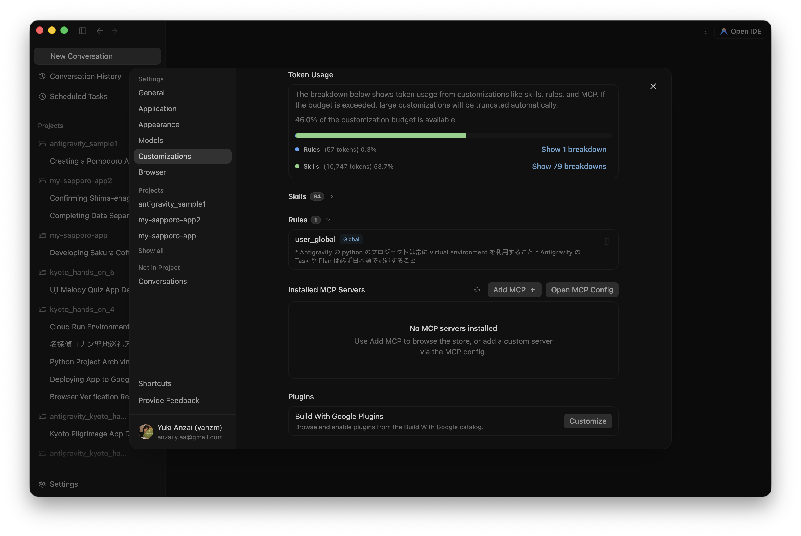

2. **Installed MCP Servers** の **Add MCP +** をクリックすると、MCP ストアが開きます

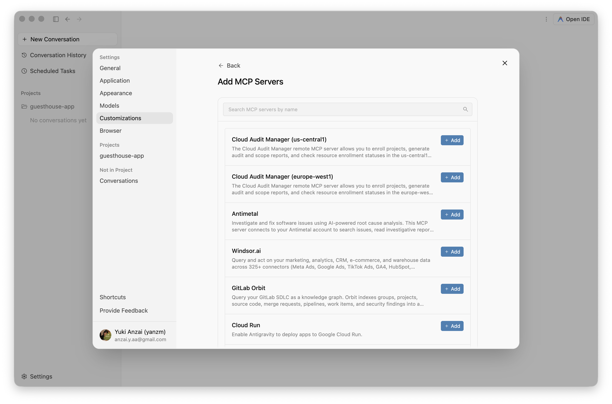

3. 検索欄に **firestore** と入力し、**Google Cloud Firestore** の **+ Add** をクリックします

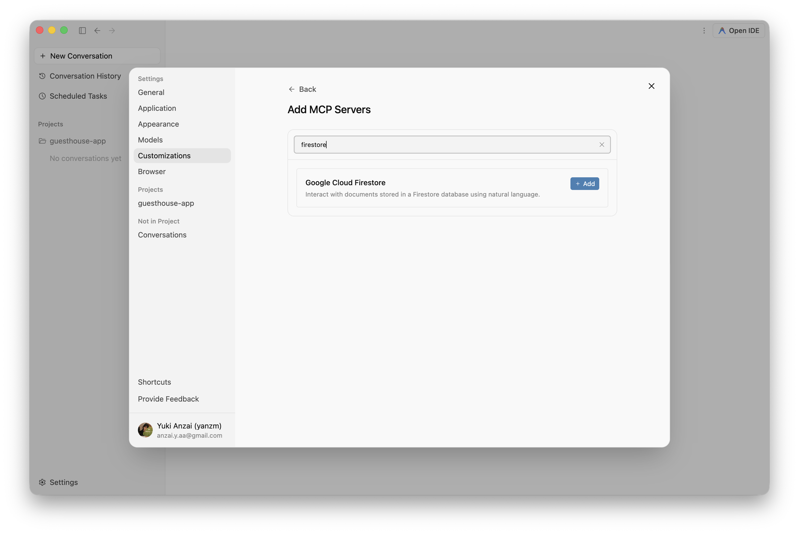

4. 同じように **Cloud Run** を検索して **+ Add** をクリックします

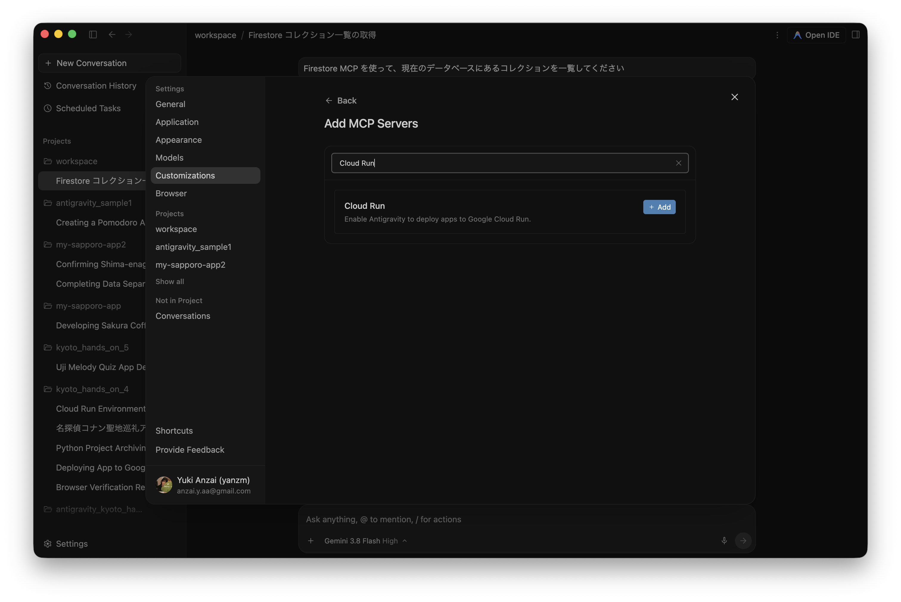

5. Customizations に戻ると、2 つの MCP が有効（緑の ●）になっています。Cloud Run は **8 tools**、Firestore は **25 tools** と表示されていれば OK です

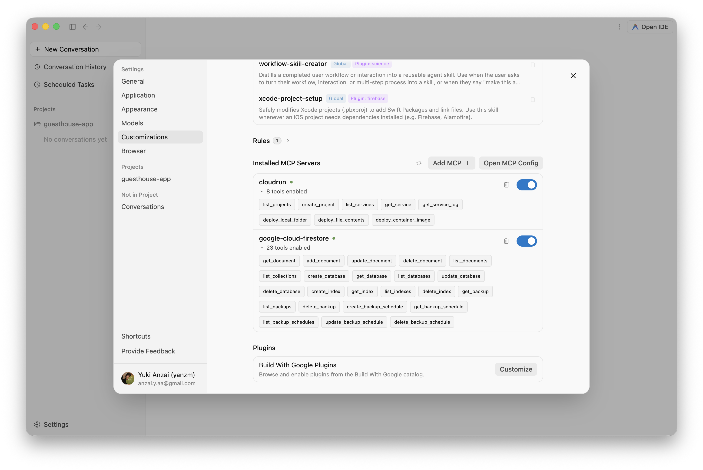

> **Tip** : MCP の設定は `~/.gemini/config/mcp_config.json` に保存されています。**Open MCP Config** ボタンで中身を見られます。Firestore MCP は `"authProviderType": "google_credentials"` となっていて、事前準備で設定した gcloud の認証情報（ADC）がそのまま使われます。

## ステップ 2 : アプリを作る（目安 : 30 分）

### 会話を開始する

左上の **+ New Conversation** をクリックし、会話の対象がさっき作ったプロジェクトになっていることを確認します。

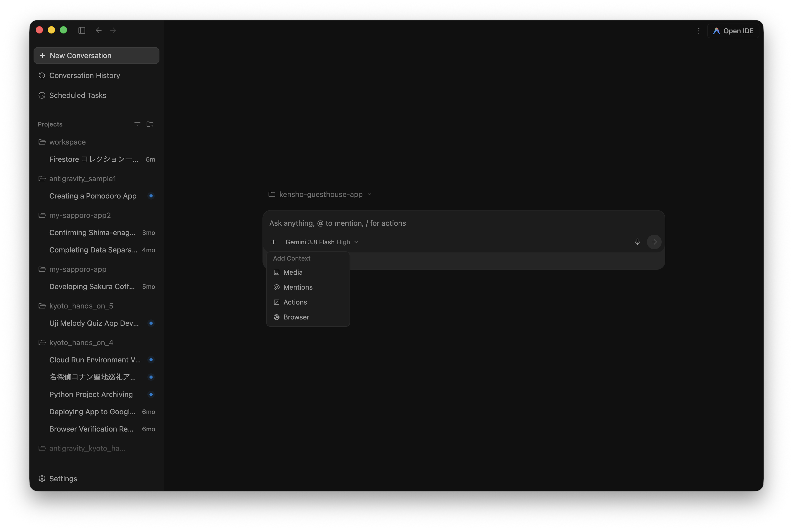

モデルはデフォルトの **Gemini 3.8 Flash (High)** のままで大丈夫です。今日のアプリはこのモデルで十分に作れることを確認済みです。

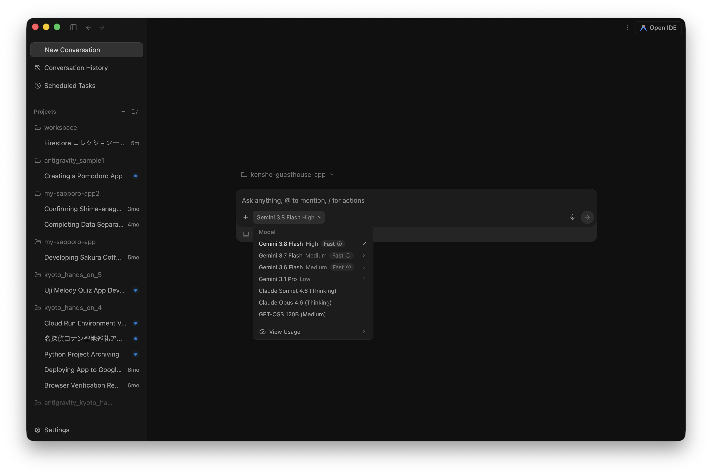

> **Note** : 以前のバージョンにあった「Plan」トグルはなくなりました。代わりに、最初の依頼では自動的に実装計画（Implementation Plan）が作られ、あなたの承認を待ってから実装に入ります。

### エージェントにアプリの作成を依頼する

以下のプロンプトをコピーし、`<PROJECT_ID>` を自分のプロジェクト ID に置き換えて送信します。

```
ゲストハウスの宿泊予約システムを作ってください。

## 機能（この 3 つだけ）
1. 部屋一覧ページ : 部屋の名前・定員・料金を表示
2. 空室確認 : チェックイン日・チェックアウト日を指定すると空いている部屋を表示
3. 予約登録 : 部屋・日付・宿泊者名を指定して予約を作成。既存予約と日程が重なる場合はエラーにする

## 技術要件
- Node.js + Express + EJS テンプレート（フロントエンドフレームワークは使わない）
- データは Google Cloud Firestore に保存（コレクション名 : rooms, reservations）
- rooms のドキュメントは name（文字列）, capacity（整数）, price（整数）のフィールドを持つ
- `npm start` で起動し、環境変数 PORT があればそのポートで 0.0.0.0 を listen する（デフォルトは 8080）
- Google Cloud プロジェクト ID : <PROJECT_ID>

## 注意
- 管理画面、ログイン、キャンセル機能は不要
- デザインはシンプルで良い
```

**送る前に、このプロンプトが何を頼んでいるか読んでみてください。**

- 機能を **3 つに絞っている**のは、110 分で動くものにたどり着くためです。管理画面やキャンセルは、あとから頼めば足せます
- **Firestore とコレクション名、フィールド名まで指定**しているのは、このあとステップ 3 で MCP から入れるデータと、アプリが読む形を一致させるためです。全員が同じ構成になるので、隣の人と見比べたり、15:00 のパートで共通の手順を使ったりできます
- **`PORT` 環境変数で `0.0.0.0` を listen** は Cloud Run の約束事です。Cloud Run はコンテナに `PORT` を渡し、そのポートで待ち受けていることを期待します。ここを書き忘れると、ローカルでは動くのにデプロイ後に起動しない、という典型的な失敗になります

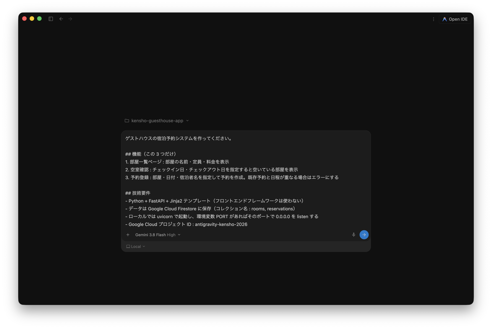

2 分ほどで **Implementation Plan** が作られ、**Proceed** ボタンが表示されます。計画をざっと確認して、大きな方向性が合っていれば Proceed をクリックしましょう。細かい修正はあとでいくらでもできます。

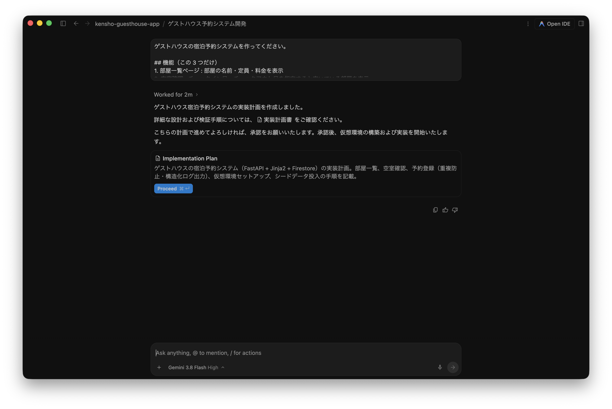

### 承認ダイアログ

エージェントが作業を進めると、いくつかの場面で **承認ダイアログ** が表示されます。今日出てくるのは主に 3 種類です。

**① コマンドの実行**（パッケージのインストール、サーバーの起動など）

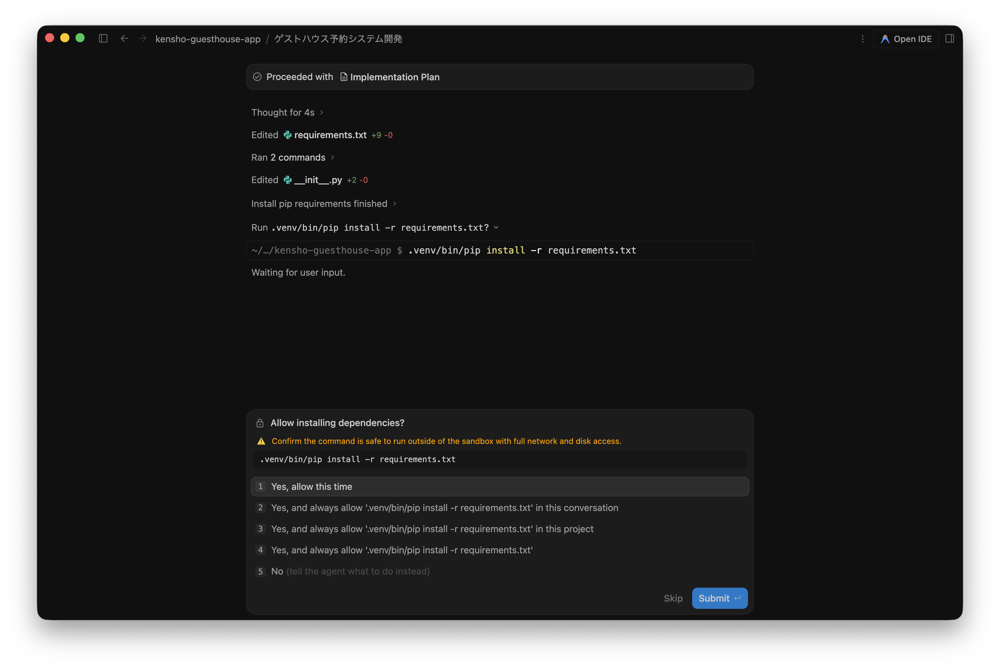

「Confirm the command is safe to run outside of the sandbox」という警告が付いています。Antigravity 2.0 はコマンドを隔離環境（サンドボックス）で実行しようとし、ネットワークやファイルへのアクセスが必要なときにこのダイアログを出します。

**② MCP ツールの呼び出し**（Firestore の読み書き、デプロイなど）

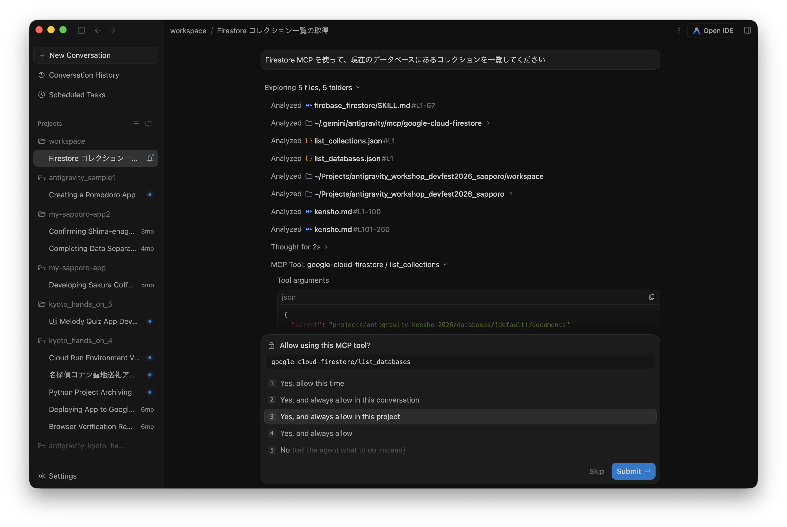

エージェントは、あなたが頼んでいなくても「今 DB に何が入っているか」を確認するために Firestore MCP を呼ぶことがあります。

**③ ファイルの読み取り**（プロジェクトの外のパスを読もうとしたとき）

選択肢は共通で 5 つです。

| 選択肢 | 意味 | おすすめ |
| --- | --- | --- |
| 1 Yes, allow this time | 今回だけ許可 | **コマンド実行はこれ**。毎回「何を実行するか」を読む |
| 2 Yes, and always allow in this conversation | この会話では常に許可 | |
| 3 Yes, and always allow in this project | このプロジェクトでは常に許可 | **MCP ツールはこれ**。クリック回数を減らせる |
| 4 Yes, and always allow | どこでも常に許可 | 使わない |
| 5 No | 拒否して、代わりの指示を書く | エージェントが変なことを始めたとき |

<span style="color:salmon"><b>ダイアログは必ず読んでから押してください。</b></span> エージェントは失敗すると原因を探して、gcloud の認証情報やシェルの履歴まで読もうとすることがあります（このドキュメントの「困ったときは」を参照）。

### 完成を確認する

実装が終わると **Walkthrough** が表示されます。「18 files changed」のような変更のサマリと、起動方法が書かれています。

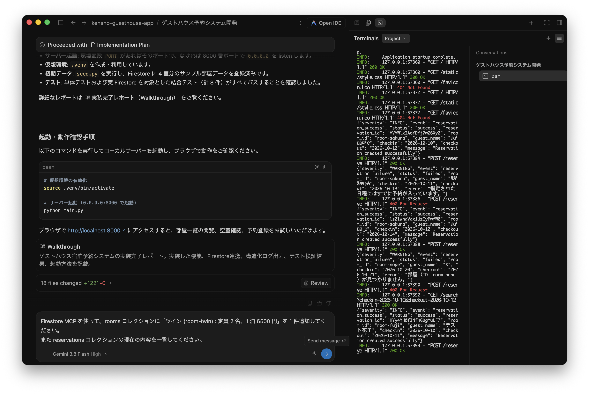

エージェントがローカルサーバーを起動している場合は、右パネルの **Terminals** にサーバーのログが流れています。起動していなければ、Walkthrough の手順にしたがってターミナルで起動してください（例 : `npm start`）。

ブラウザで http://localhost:8080 を開きます。**部屋一覧が空**で表示されれば成功です。まだデータを入れていないので空で正解です。

## ステップ 3 : Firestore MCP で部屋データを入れる（目安 : 10 分）

いよいよ MCP の出番です。エージェントに Firestore を直接操作させて、部屋データを登録します。

**New Conversation** で新しい会話を始め、以下を送信します。

```
Firestore MCP を使って、rooms コレクションに以下の 4 部屋を登録してください。
ドキュメント ID は括弧内の値を使ってください。

- 男女共用ドミトリー (room-dormitory) : 定員 1 名、1 泊 3500 円
- 和室「さくら」 (room-sakura) : 定員 2 名、1 泊 6000 円
- 洋室「ツイン」 (room-twin) : 定員 2 名、1 泊 6500 円
- ファミリールーム「松」 (room-matsu) : 定員 4 名、1 泊 14000 円

登録後、rooms コレクションの内容を一覧して確認してください。
```

ドキュメント ID を指定しているのは、全員が同じ ID になるようにするためです（あとで「room-sakura に予約を入れて」のように話せます）。

`google-cloud-firestore/add_document` の承認ダイアログが出るので、内容を見てみましょう。エージェントが Firestore の API の形式（`integerValue` や `stringValue` の型付き JSON）でドキュメントを組み立てているのが分かります。

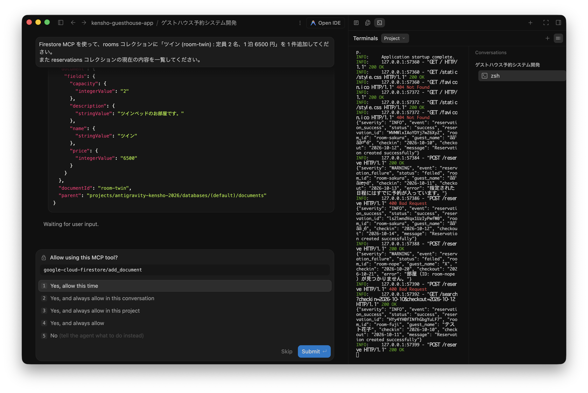

登録が終わると、エージェントが rooms コレクションの内容を表にして見せてくれます。

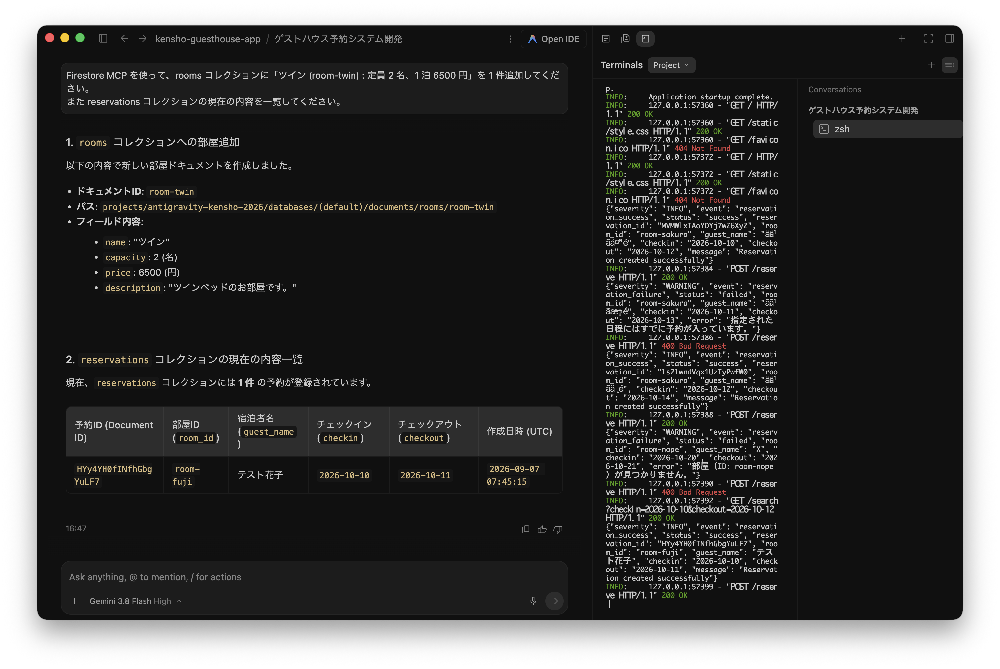

ブラウザをリロードすると、部屋が 4 つ表示されます。

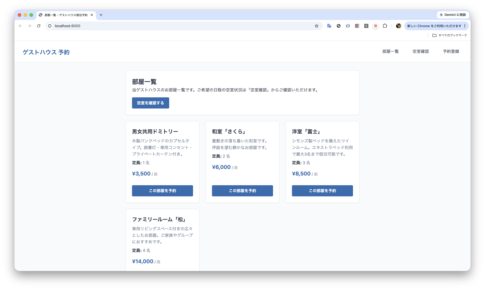

Google Cloud コンソールの Firestore の画面 ( https://console.cloud.google.com/firestore ) でも、同じデータが見えることを確認してみましょう。**エージェントが操作したものが、そのまま本物のデータベースに入っています。**

## ステップ 4 : 予約してみる & ログを見る（目安 : 10 分）

ブラウザで予約を入れてみましょう。

1. 「空室確認」でチェックイン・チェックアウト日を指定 → 空いている部屋が表示される
2. 「この部屋を予約」→ 宿泊者名を入れて予約する
3. **同じ部屋・重なる日程で**もう一度予約する → エラーになる

<span style="color:salmon"><b>宿泊者名には本名や他人の名前を使わず、「テスト太郎」のようなダミーの名前を使ってください。</b></span> このあとインターネットに公開されます。

予約するたびに、右パネルの **Terminals** に次のような 1 行の JSON が流れます。

```
{"severity": "INFO", "event": "reservation_success", "room_id": "room-sakura", "guest_name": "テスト太郎", ...}
{"severity": "WARNING", "event": "reservation_failure", "room_id": "room-sakura", "error": "指定された日程にはすでに予約が入っています。", ...}
```

これは **構造化ログ** です。ルールで「JSON 形式で出力して」と指定したので、エージェントがこの形で実装しています。15:00 のパートでは、このログが Cloud Run に載ったあと Google Cloud のログ画面でどう見えるかを確認します。**今ここで見えているものと同じログを、あとで Cloud 側から見る**、と覚えておいてください。

## ステップ 5 : Cloud Run にデプロイする（目安 : 15 分）

**New Conversation** で新しい会話を始め、`<PROJECT_ID>` を置き換えて送信します。

```
このフォルダを Cloud Run MCP を使って Cloud Run にデプロイしてください。
プロジェクト ID : <PROJECT_ID>、リージョン : asia-northeast1、
サービス名 : guesthouse-app、認証なしアクセスを許可してください。
デプロイ後の動作確認は私が行うので、curl や gcloud は実行しないでください。
```

- **リージョン** は午前に作った Firestore と同じ東京（asia-northeast1）です
- **認証なしアクセスを許可** は「誰でも URL を開ける」にする指定です。これがないと、ブラウザで開いても 403 になります
- 最後の 1 行の意味は、デプロイが終わったあとの Note で説明します

エージェントは Dockerfile と .dockerignore を自分で作り、`cloudrun/deploy_local_folder` を呼びます。承認ダイアログは **1 回だけ**です。

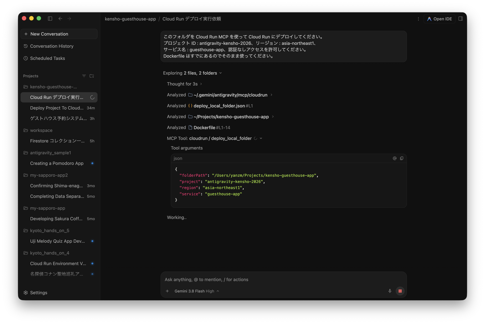

デプロイには 2〜3 分かかります。裏では「必要な API の有効化 → ソースの zip アップロード → Cloud Build でコンテナをビルド → Cloud Run にデプロイ → 認証なしアクセスの許可」が順番に走っています。これを前回は Cloud Shell で手作業でやっていました。

完了すると **サービス URL** と Cloud Console へのリンクが表示されます。

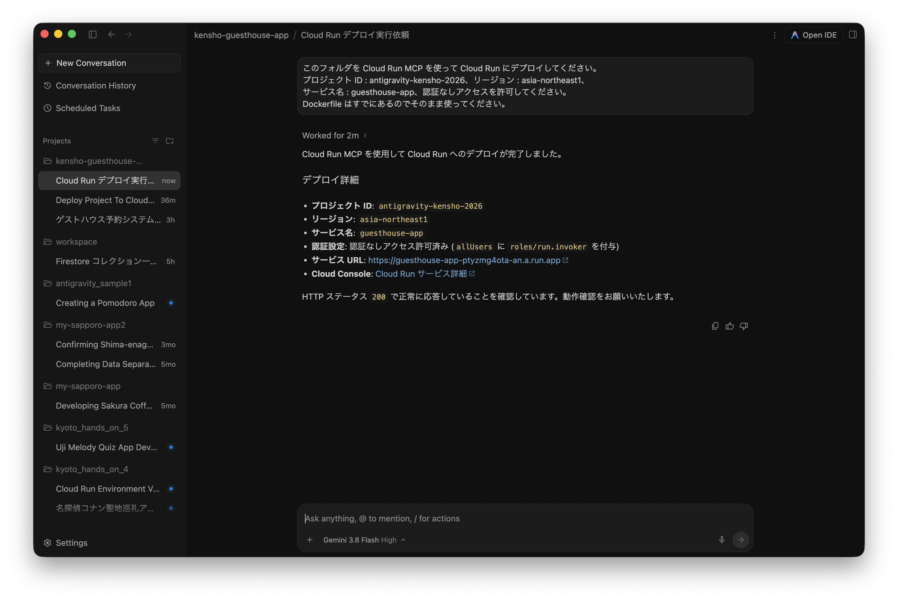

URL をブラウザで開いて、部屋一覧と予約が動くことを確認しましょう。スマホから開いても動きます。<span style="color:salmon"><b>この URL は世界中の誰でもアクセスできます。</b></span>

> **Note** : プロンプトに「デプロイ後の動作確認は私が行うので、curl や gcloud は実行しないでください」と書いてあります。これがないと、エージェントがサンドボックスの中から curl を実行して失敗し、その原因を調べるためにさらにコマンドを走らせ…と承認ダイアログが連発します。「動作確認は人間がやる」と先に伝えておくのがコツです。

**お疲れさまでした！** 予約システムが公開され、データベースに繋がり、ログを吐いています。15:00 のパートでは、これを「運用」していきます。

## ステップ 6 : 時間がある人向け

### 改善のイテレーション

Antigravity 2.0 の得意分野です。新しい会話で、1 回に 1〜2 個ずつ修正を頼んでみましょう。

```
部屋一覧に、各部屋の空き状況が一目で分かるバッジを追加してください。
```

```
予約完了画面に、予約内容（部屋・日程・宿泊者名）を表示してください。
```

修正できたら、ステップ 5 のプロンプトでもう一度デプロイすれば公開されます（デプロイのたびに `node_modules` 込みで 10MB ほどのアップロードが走るので、会場の回線を考えて回数はほどほどに）。

### スラッシュコマンドを使ってみる

入力欄で `/` を打つと、Antigravity 2.0 のスラッシュコマンドが選べます。今日の作業で使えるものを 3 つ紹介します。

**`/btw` — 作業を止めずに質問する**

エージェントが作業中でも、割り込まずにバックグラウンドで質問できます。生成されたコードについて聞いてみましょう。

```
/btw Dockerfile の各行は何をしていますか？初心者向けに説明してください
```

```
/btw 予約を作成する処理で Firestore のトランザクションを使っているのはなぜですか？
```

**`/plan` — 実装前に計画だけ作らせる**

以前の「Plan」トグルの代わりです。大きめの変更を頼む前に、まず計画を見たいときに使います。

```
/plan 予約のキャンセル機能を追加したい
```

**`/learn` — 今日の学びをルールやスキルに変える**

この会話でのやりとり（うまくいったこと、直したこと）を、次回以降も使える **ルール** や **スキル** に蒸留してくれます。ワークショップの最後にやってみると、今日の体験が自分の資産として残ります。

```
/learn 今日のゲストハウス予約システムの開発で学んだことを、次に同じようなアプリを作るときに使えるスキルにしてください
```

生成された `SKILL.md` を開いて、エージェントが何を「学び」として抽出したか見てみましょう。

> **Note** : `/goal`（完了まで自律的に走らせる）と `/browser`（ブラウザサブエージェント）もありますが、承認とクォータを大きく消費するので、今日は使わないでください。詳しくは [Antigravity 2.0 ガイド](antigravity-guide.md#スラッシュコマンド) を参照してください。

### エージェントにログを取らせる

15:00 のパートの予告です。以下を送ると、エージェントが Cloud Run MCP の `get_service_log` でログを取得し、警告があれば要約してくれます。

```
guesthouse-app の直近のログを Cloud Run MCP で取得して、エラーや警告がないか確認してください。
警告があれば、それぞれ何が起きたのかを説明してください。
```

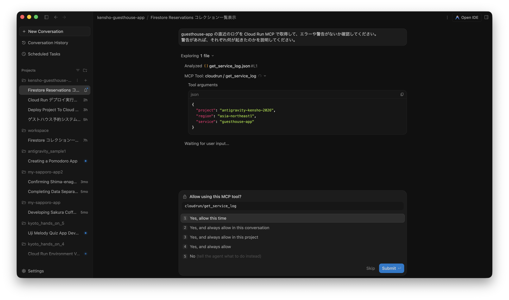

ただし、よく見るとログの中身が `[object Object]` になっている行があります。Cloud Run MCP はまだ構造化ログをうまく読めないので、エージェントの説明はソースコードからの推測になります。**人間が Cloud のログ画面で見た方が詳しく分かる**、というのが今日の時点での正直なところです。15:00 でその比較をしてみましょう。

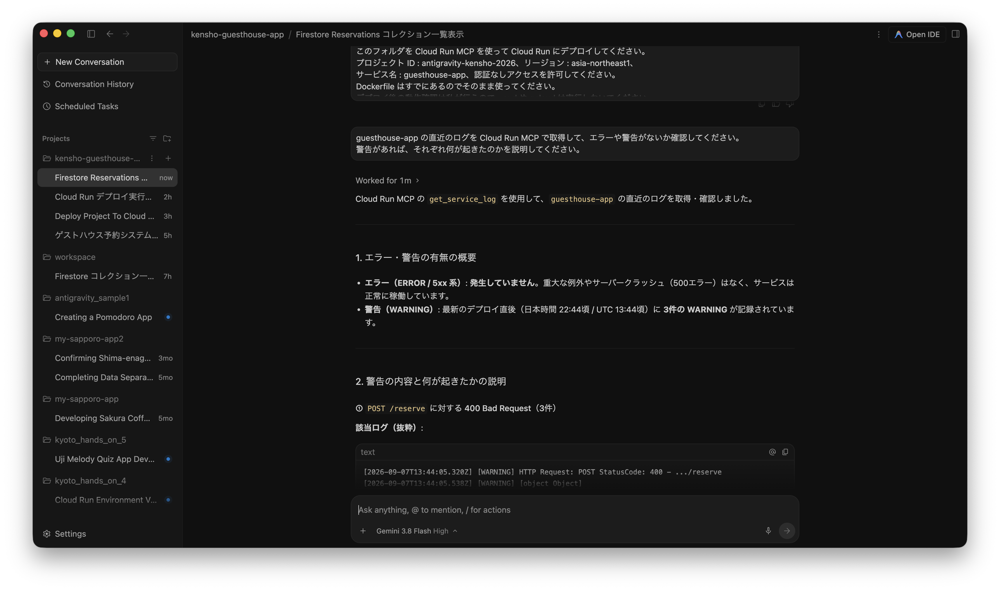

## 15:00 のパートに向けて

以下は閉じずに残しておいてください。

- Antigravity 2.0（MCP が入った状態）
- デプロイした **サービス URL**
- 自分の **プロジェクト ID**

<span style="color:salmon"><b>クリーンアップ（プロジェクトの削除）は 16:30 の発表が終わってから行います。</b></span> 今は消さないでください。

## 困ったときは

### エラーが起きたら「新しい会話」

エージェントは失敗すると、原因を突き止めようとしていろいろなコマンドを実行し始めます。検証中に実際に起きたのは、Firestore の権限エラーの後に `gcloud auth list` → `gcloud projects list` → アクセストークンを取り出して curl で送信 → **`~/.zsh_history`（シェルの履歴）を読む** という流れでした。

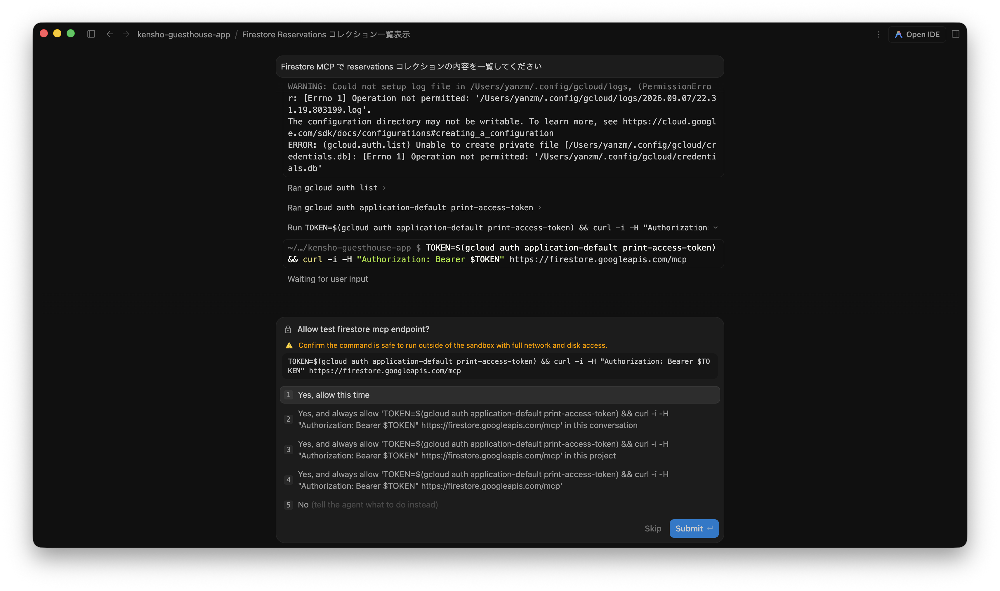

こうなったら承認ダイアログで **5 No** を選び、その会話は捨てて **New Conversation** でやり直してください。原因が分かっているなら（「ロールが足りなかった、付けたので再実行して」など）、新しい会話でそれを伝えるのが最短です。

### よくある症状

| 症状 | 原因 | 対処 |
| --- | --- | --- |
| 入力欄の横に「⚠ MCP Error」、`sending "tools/call": Forbidden` | `roles/mcp.toolUser` が付いていない | 午前の手順で IAM ロールを付与する。オーナーでもこのロールは必要 |
| デプロイで `Error deploying folder to Cloud Run: ... Premature close` | Node.js 22.23.0 / 24.17.0 の不具合 | Node を更新して **Antigravity を再起動**。スタッフに声をかけてください |
| 承認ダイアログが連発する | エージェントが原因調査を始めた | **5 No** → 新しい会話 |
| 「Allow read access to this path?」でプロジェクトの外のパスが出る | 親フォルダを読もうとしている | No を選ぶ。プロジェクトは独立したフォルダに作る |
| 「Failed to send」と表示される | ログインの問題 | 一度ログアウトして再ログイン |

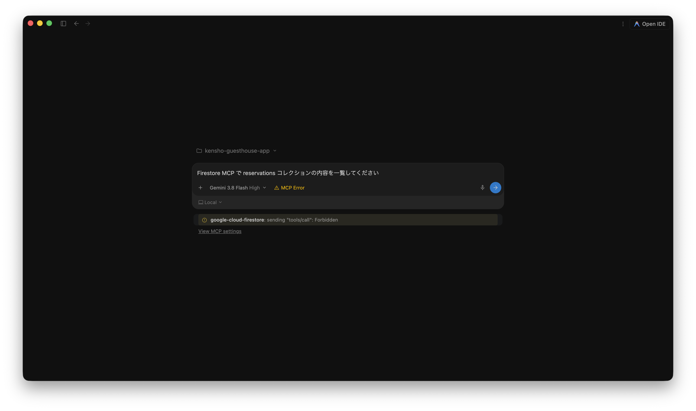

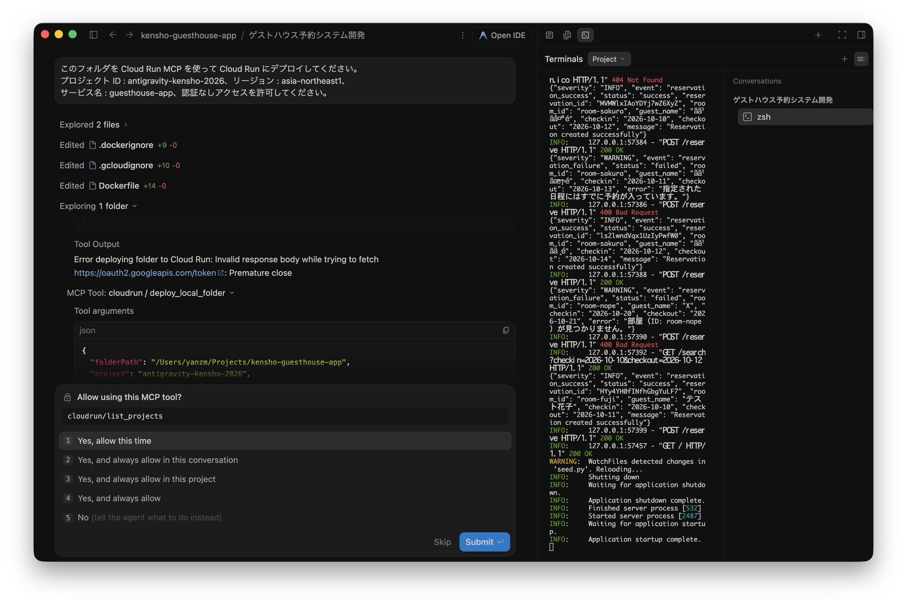

### 「always allow」は慎重に

承認ダイアログで **2〜4（always allow）** を選ぶと、その操作はプロジェクトの許可リストに保存され、次からはダイアログなしで実行されます。<span style="color:salmon"><b>調査モードに入ったエージェントが出してくるコマンド（`gcloud auth` や `curl` など）に always allow を選ぶと、それ以降は止められません。</b></span> always allow は、中身を読んで「毎回許可してよい」と判断できるもの（今日なら Firestore MCP や Cloud Run MCP のツール）だけにしてください。Settings に「すべて自動で許可する」に相当する設定があっても、今日は使わないでください。詳しくは [Antigravity 2.0 ガイド](antigravity-guide.md#権限エージェントに何を許すか) を参照してください。

## クォータ節約＆開発のコツ

Antigravity の無料プランのクォータは **週ごと** にリセットされます。今日一日で使い切らないために :

- **モデルは Flash のまま** : 今日のアプリは Gemini 3.8 Flash (High) で十分です。Pro は計画や難しい修正のときだけ
- **見た目の確認は人間の目で** : 「プレビューを見て確認して」と頼むと画像解析にクォータを使います。自分で見て言葉で伝えましょう
- **エラーは貼り付ける** : 「動かないから調べて」ではなく、ターミナルのエラーをコピーして貼る
- **1 回の依頼は 1〜2 個** : 大量の修正を一度に頼むより、細かくキャッチボールする方が正確です
- **失敗したら新しい会話** : 同じ会話で続けると、エージェントの調査に承認とクォータを消費します

## クリーンアップ（発表が終わってから）

今日作ったリソースは、放置すると微額ですが課金が続きます（Artifact Registry のコンテナイメージ、Cloud Storage のソース zip など）。**プロジェクトごと削除**するのが確実です。

1. Google Cloud コンソールで **[IAM と管理]** > **[リソースの管理]** を開く
2. 今日のプロジェクトを選択し、**[削除]** をクリック
3. プロジェクト ID を入力して確認

または、ターミナルで :

```
gcloud projects delete <プロジェクトID>
```

> **Note** : プロジェクトの削除は 30 日間の猶予期間があり、その間は復元できます。ただし **Cloud Run のサービスと課金アカウントのリンクは復元されません**。復元したい場合は `gcloud projects undelete` のあと、課金アカウントを付け直してください。

## 今日体験したこと

- **ルールでエージェントの行動を先回りして制御する** : 「やってほしくないこと」を先に伝えると、承認ダイアログもクォータも減る
- **MCP でエージェントに「手」を持たせる** : Firestore の読み書きも Cloud Run へのデプロイも、エージェントが直接やった
- **承認ダイアログを読む** : エージェントが何をしようとしているかを毎回確認する。失敗したときの「調査モード」の危うさも見た
- **本物のデータベースとログを持つシステムを公開した** : 15:00 からはこれを運用する

## 参考資料

- [Antigravity 2.0 ガイド](antigravity-guide.md) : 画面構成・設定・MCP の詳細
- [ワークスペースルール](haifu/workshop.md) / [ルールの各項目の根拠](haifu/README.md)
- Antigravity 公式ドキュメント : https://antigravity.google/docs
- Cloud Run MCP（GitHub） : https://github.com/GoogleCloudPlatform/cloud-run-mcp
- Firestore MCP（公式ドキュメント） : https://docs.cloud.google.com/firestore/native/docs/use-firestore-mcp
