# Antigravity 2.0 と MCP でゲストハウス予約システムを作って Cloud Run に公開しよう

〜 DevFest Sapporo 2026 : WorkShop「Antigravity 2.0 の章」（13:00 - 14:50）〜

講師 : あんざいゆき ( https://x.com/yanzm )

普段は Android アプリを開発するお仕事をしています。最近は AI に個人開発アプリの実装を手伝ってもらったり、自分用の便利ツールを作ってもらったりしてます。めっちゃ楽しいです。

<span style="color:salmon"><b>※ このドキュメントは 2026/10 時点の Antigravity 2.0（v2.19.1）で検証した内容です。Antigravity は活発にアップデートされているため、画面が異なる場合は最新の公式ドキュメント ( https://antigravity.google/docs ) を確認してください。</b></span>

## 今日 1 日の流れ

| 時間 | 内容 | 担当 |
| --- | --- | --- |
| 11:05 - 11:40 | WorkShop **Cloud の章** : Google Cloud 導入部レクチャー | sinmetal さん |
| 11:40 - 12:00 | 導入作業（**Google Cloud のセットアップを講師と一緒に**。[setup-gcp.md](setup-gcp.md)） | 全員 |
| 12:00 - 13:00 | お昼休憩 | |
| **13:00 - 14:50** | **WorkShop Antigravity 2.0 の章 : アプリ作成 & ビルド** ← このドキュメント | あんざい |
| 15:00 - 16:30 | WorkShop **アッセンブルの章** : Cloud Run + Cloud 制御（運用） | sinmetal さん・yoichiro さん |
| 16:30 - 16:50 | 発表・クロージング | |

## このセッションの目標

**全員で同じ「ゲストハウスの宿泊予約システム」を作り、Cloud Run に公開するところまで**を、Antigravity 2.0 のエージェントに任せて体験します。

ポイントは 2 つです。

- **データベース（Firestore）を使う** : 予約が保存される「本物のシステム」です。15:00 のパートでこのシステムを「運用」します
- **MCP を使う** : エージェントに「道具」を持たせる仕組みです。今日はエージェントが Firestore のデータを直接読み書きしたり、作ったアプリをそのまま Cloud Run に公開したりします。あなたは「デプロイして」と頼むだけです

あなたの役割は **「開発のディレクター」** です。コードを書くのはエージェントで、あなたは何を作るかを決め、承認ダイアログを読み、動くものを確認し、次の指示を出します。「完璧な設計図を作る」のではなく、「ざっくり作って、動くものを見ながら手直しする」体験をしてください。

## Antigravity 2.0 とは

[Antigravity](https://antigravity.google/) は Google が提供するエージェント型開発プラットフォームです。2026 年 6 月の 2.0 で、**Antigravity 2.0**（エージェントを動かすデスクトップアプリ）と **Antigravity IDE**（従来の VS Code ベースのエディタ）の 2 つのアプリに分かれました。

今日は **Antigravity 2.0** を主に使います。ファイルツリーやエディタはなく、会話とエージェントの作業パネルだけのシンプルな画面ですが、ターミナルは内蔵されています。ファイルを自分で作ったり直したりするとき（ステップ 0 のルール作成）は、**Antigravity IDE** で同じフォルダを開きます。

詳しくは [Antigravity 2.0 ガイド](antigravity-guide.md) を参照してください。

## 事前準備の確認

以下がすべて済んでいるか確認してください。<span style="color:salmon"><b>まだの方は手をあげて教えてください！</b></span>

**事前準備（connpass に記載）**

- [ ] **Antigravity 2.0** と **Antigravity IDE** の両方がインストールされている
- [ ] Antigravity IDE に、個人の Google アカウントでログインできている（Antigravity 2.0 のログインはこのあと行います）
- [ ] gcloud CLI がインストールされている
- [ ] Node.js が **22.23.1 以降 または 24.18 以降**（`node -v` で確認。<span style="color:salmon">22.23.0 と 24.17.0 は NG</span>）

**午前の「Cloud の章」で、講師と一緒に自分の手でやったもの**（[setup-gcp.md](setup-gcp.md)）

- [ ] `gcloud auth login` と `gcloud auth application-default login` の両方を実行した
- [ ] ワークショップ用のクレジットを取得し、その課金アカウントで Google Cloud プロジェクトを作成した
- [ ] Firestore データベースを作成した（Native mode / asia-northeast1 / `(default)`）
- [ ] Agent Platform API と Cloud Resource Manager API を有効化した
- [ ] 自分のアカウントに `roles/mcp.toolUser` と `roles/datastore.user` を付与した

ターミナルで以下を実行して、エラーにならなければ準備完了です。

```
node -v
gcloud auth application-default print-access-token
gcloud config get-value project
```

最後のコマンドで表示される **プロジェクト ID** は、このあと何度も使うのでメモしておいてください。

> **Note** : Node.js のバージョンが 22.23.0 または 24.17.0 だった場合、ステップ 5 のデプロイが必ず失敗します（Node 本体の不具合です）。今のうちに新しいバージョンに更新してください。

## Antigravity 2.0 にログインする

Antigravity 2.0 には、午前に作った Google Cloud プロジェクトを使ってログインします。こうすると、エージェントが使うモデルの利用料が、使った分だけ午前に取得したクレジットから支払われます。全員が同じ条件で、同じモデルを使えます。

### 1. ログインする

すでに個人の Google アカウントでログインしている場合は、先に左下の **Settings** → **Account** → **Sign Out** でサインアウトしてください。

1. サインインの画面で **Use business account** をクリックします

   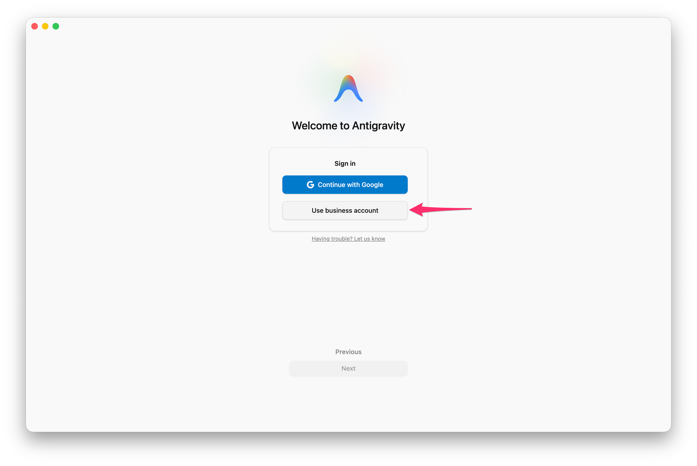

2. **Continue with Google Cloud** をクリックします。ブラウザが開くので、午前にプロジェクトを作ったのと同じ Google アカウントでログインします

   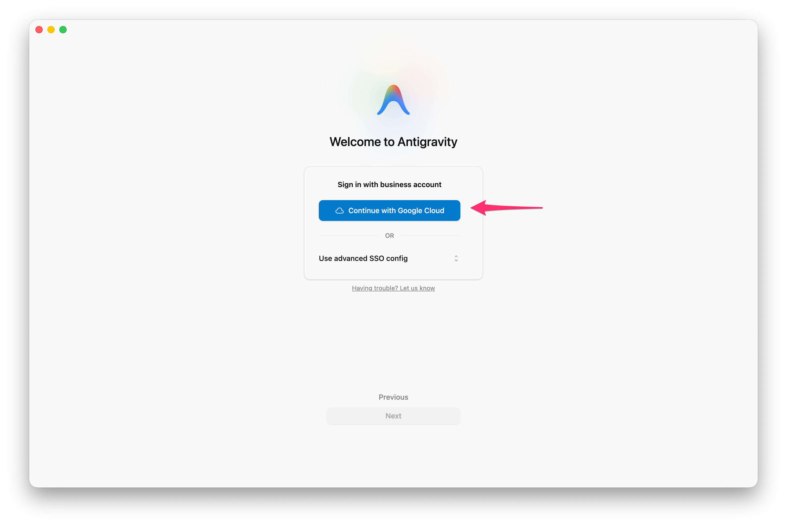

3. **Select billing model** の画面になります。右の **Pay as you go** をクリックし、**Provide Google Cloud Project** に午前に作ったプロジェクト ID を入力します。続いて **Choose Region** が出るので **Global** を選び、**Next** をクリックします

   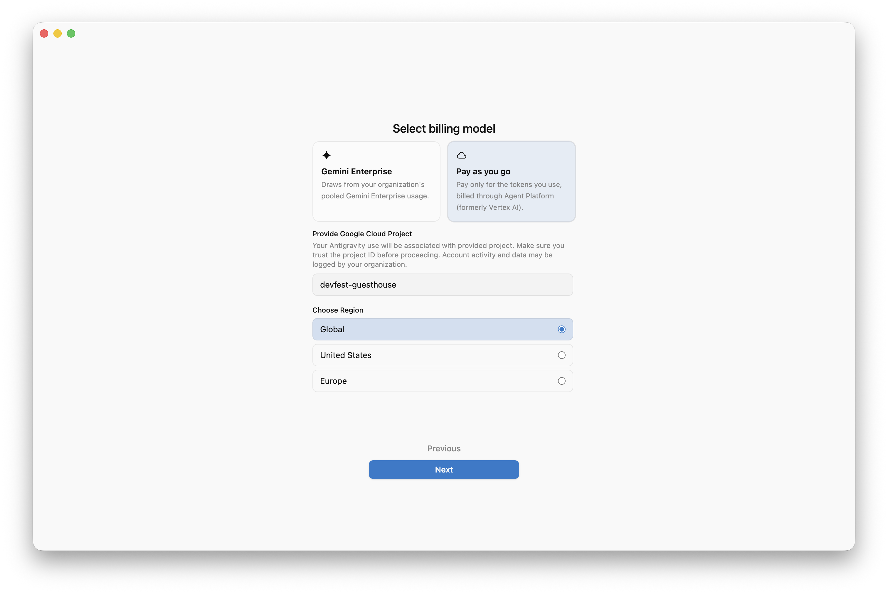

4. **Terms of Service & Data Use** の画面が出ます。内容を確認して **Finish** をクリックします

### 2. 確認する

左下の **Settings** → **Account** を開き、**Your Plan: Agent Platform** と自分のプロジェクト ID が表示されていればログイン完了です。

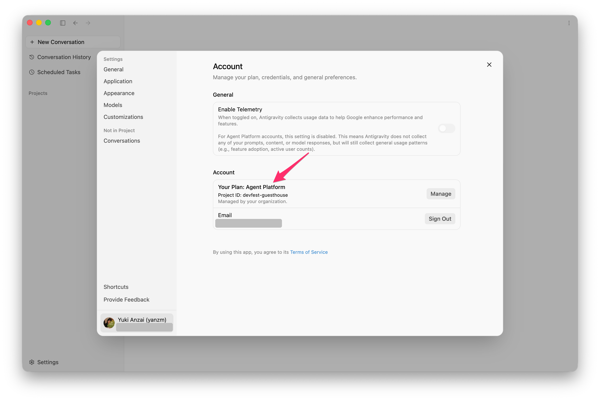

> **Note** : 午前の手順で Agent Platform API を有効化していないと、最初の依頼で次のエラーになります。
>
> ```
> Error Agent Platform API has not been used in project <プロジェクトID> before or it is disabled. Enable it by visiting https://console.developers.google.com/apis/api/aiplatform.googleapis.com/overview?project=<プロジェクトID> then retry. If you enabled this API recently, wait a few minutes for the action to propagate to our systems and retry.
> ```
>
> ターミナルで `gcloud services enable aiplatform.googleapis.com` を実行し、1 分ほど待ってから **Retry** を押してください（[setup-gcp.md の 6](setup-gcp.md#6-午後に使う-api-を有効化する当日)）。

## ステップ 0 : プロジェクトを作ってルールを置く（目安 : 10 分）

### プロジェクトフォルダを作る

Antigravity 2.0 を起動します。まだプロジェクトがないので、左の **Projects** は空です。

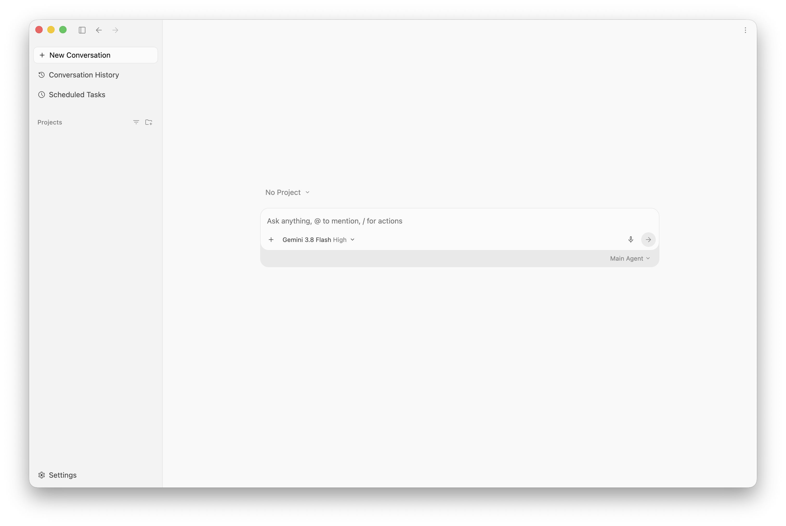

**Projects** の横にあるフォルダのアイコン（**Create New Project**）をクリックし、**New Project** を選びます。

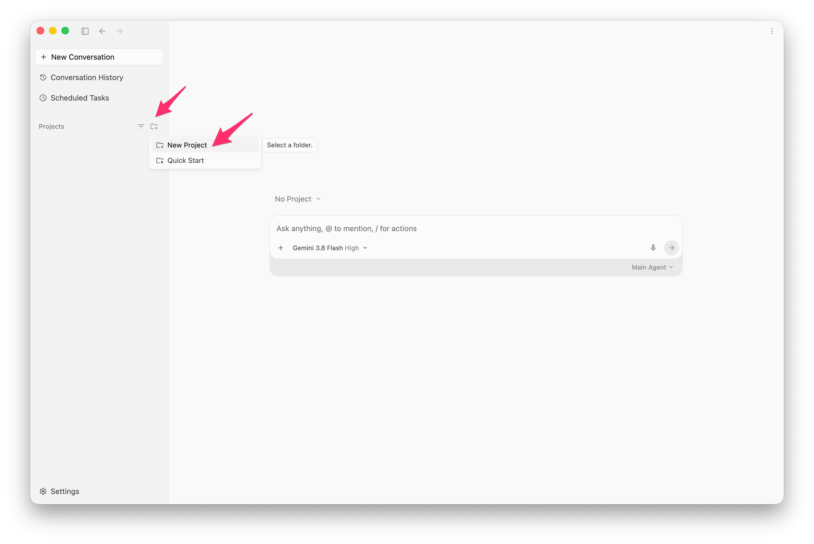

フォルダの選択画面が開くので、`~/Projects/guesthouse-app` のように、**新しく作った空のフォルダ**を選びます。場所はどこでも構いませんが、エージェントは作業中に 1 つ上のフォルダを読みに行こうとすることがあります。そのときは「Allow read access to this path?」というダイアログが出るので、**No** を選んでください（ダイアログの見方はステップ 2 で説明します）。

左の **Projects** にフォルダが表示され、入力欄の上のプロジェクト名もそのフォルダになれば OK です。

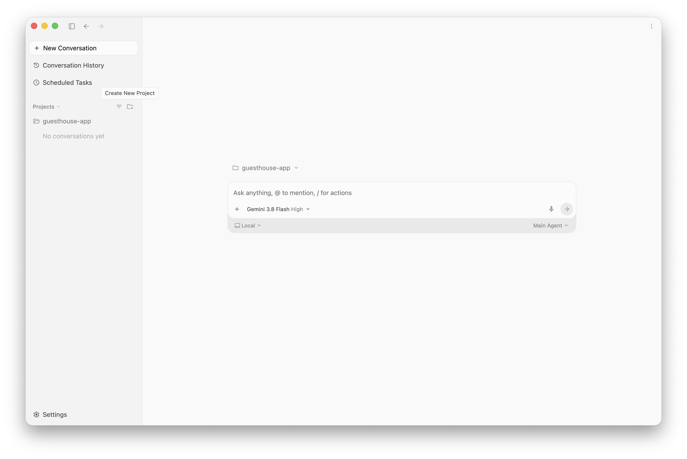

### ワークスペースルールを置く

エージェントの動作を制御する **ルール** を配置します。今日の作業で「やってほしくないこと」（余計なテストを書く、勝手に初期データを入れる、エラーのたびに認証情報を探し回る…）を先に伝えておくためのものです。

ルールは、プロジェクトの `.agents/rules/` フォルダに置いた Markdown ファイルです。Antigravity 2.0 にはエディタがないので、**Antigravity IDE** でファイルを作ります。

> **Note** : 個人の Google アカウントでログインした Antigravity 2.0 には、右上に **Open IDE** ボタンがあり、同じフォルダをそのまま IDE で開けます。今日は business account でログインしているので、このボタンは表示されません。IDE を自分で起動して、フォルダを開きます。

1. **Antigravity IDE** を起動し、メニューの **File** → **Open Folder…** で、いま作ったプロジェクトのフォルダを開きます

   IDE のログインは 2.0 とは別で、**個人の Google アカウント**（Continue with Google）を使います。IDE は、2.0 で行った business account でのログインに対応していないためです。今日 IDE でやるのはファイルを作ることだけで、IDE のエージェントは使いません

   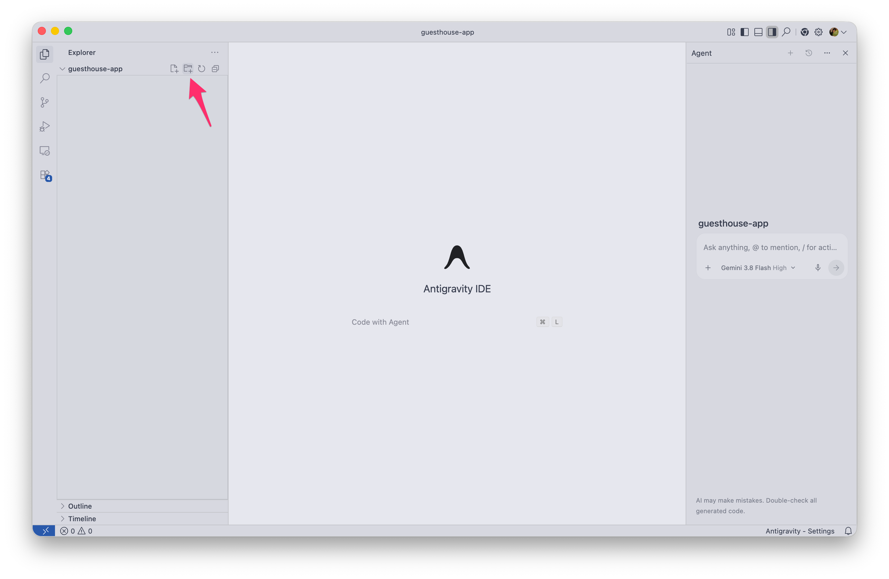

2. IDE の左のファイルエクスプローラで、プロジェクト名の右にある **New Folder** アイコンから `.agents` フォルダを作り、その `.agents` を選んだ状態でもう一度 **New Folder** で `rules` を作ります

   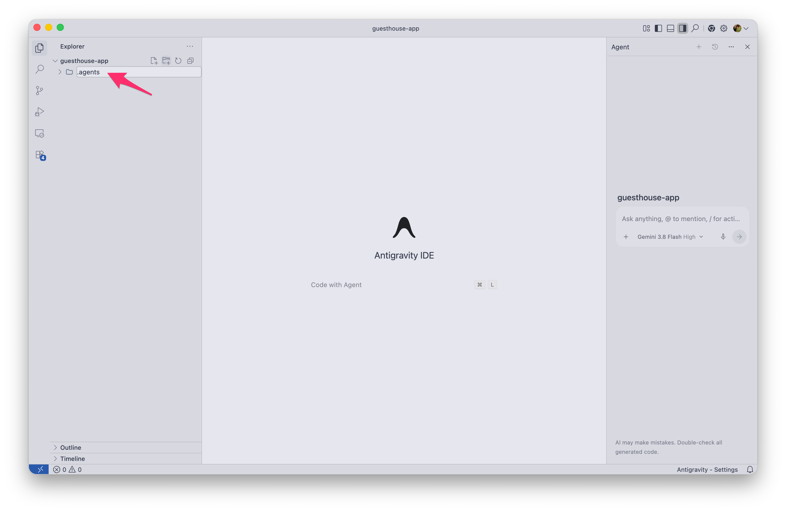

   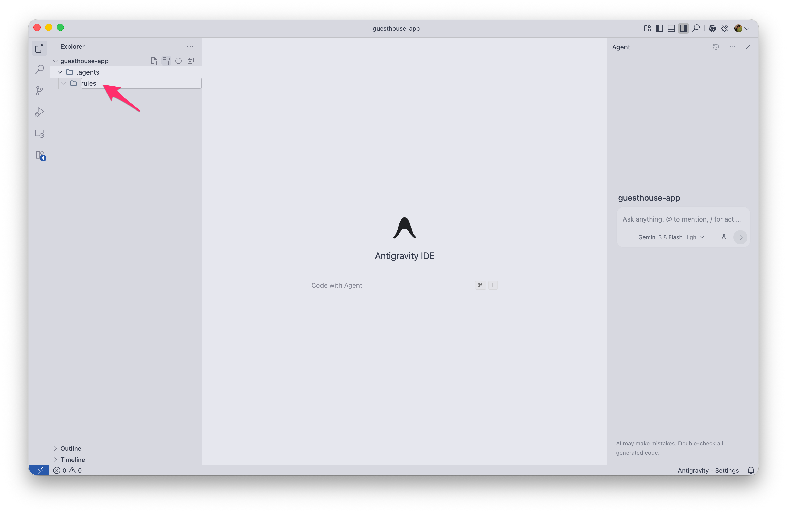

3. `rules` フォルダを選んだ状態で **New File** アイコンから `workshop.md` を作ります

   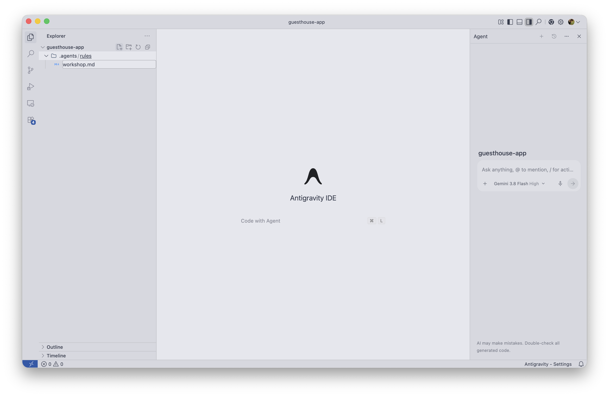

4. 作ったファイルを開くと、**ルール専用の編集画面**が表示されます

   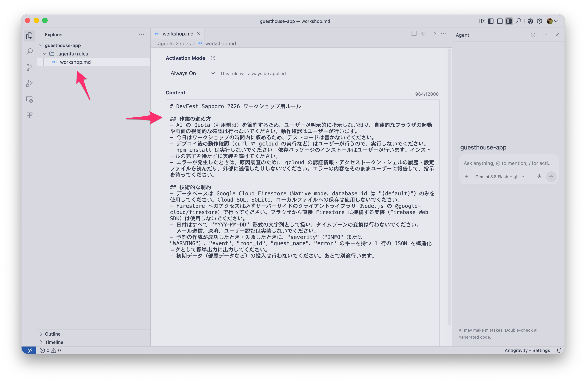

   - **Activation Mode** : **Always On** を選びます（「このルールを常に適用する」という意味です）
   - **Content** : 以下をそのまま貼り付けます

```
# DevFest Sapporo 2026 ワークショップ用ルール

## 作業の進め方
- AI の Quota（利用制限）を節約するため、ユーザーが明示的に指示しない限り、自律的なブラウザの起動や画面の視覚的な確認は行わないでください。動作確認はユーザーが行います。
- 今日はワークショップの時間内に収めるため、テストコードは書かないでください。
- デプロイ後の動作確認（curl や gcloud の実行など）はユーザーが行うので、実行しないでください。
- npm install は実行しないでください。依存パッケージのインストールはユーザーが行います。インストールの完了を待たずに実装を続けてください。
- エラーが発生したときは、原因調査のために gcloud の認証情報・アクセストークン・シェルの履歴・設定ファイルを読んだり、外部に送信したりしないでください。エラーの内容をそのままユーザーに報告して、指示を待ってください。

## 技術的な制約
- データベースは Google Cloud Firestore（Native mode、database id は "(default)"）のみを使用してください。Cloud SQL、SQLite、ローカルファイルへの保存は使用しないでください。
- Firestore へのアクセスは必ずサーバーサイドのクライアントライブラリ（Node.js の @google-cloud/firestore）で行ってください。ブラウザから直接 Firestore に接続する実装（Firebase Web SDK）は使用しないでください。
- 日付はすべて "YYYY-MM-DD" 形式の文字列として扱い、タイムゾーンの変換は行わないでください。
- メール送信、決済、ユーザー認証は実装しないでください。
- 予約の作成が成功したとき・失敗したときに、"severity"（"INFO" または "WARNING"）、"event"、"room_id"、"guest_name"、"error" のキーを持つ 1 行の JSON を構造化ログとして標準出力に出力してください。
- 初期データ（部屋データなど）の投入は行わないでください。あとで別途行います。
```

5. 保存します（`Cmd + S` / `Ctrl + S`）

このファイルは、エージェントへの「常に守ってほしいこと」の一覧です。貼り付けた内容を読んでみてください。

<details>
<summary>各ルールの理由（クリックで開く）</summary>

「テストを書かない」「初期データを入れない」「エラーのときに認証情報を探さない」といった項目は、**事前検証でエージェントが実際にやってしまったこと**を先回りして止めています。

| ルール | 理由 |
| --- | --- |
| ブラウザ検証をしない | エージェントの自動ブラウザ検証は画像解析でモデルの利用量が大きくなる。動作確認は人間が目でやる |
| 今日はテストコードを書かない | 頼まなくてもテストを書いて実行し、時間と承認ダイアログが増えるため。テストが失敗すると直しに入ってさらに時間がかかる。**普段の開発ではテストを書かせるのは良いことです**。今日は 110 分に収めるために省いています |
| npm install を実行しない | 外部からライブラリを取ってくる操作は、何が入るかを自分で見てから自分の手で実行するため。また、エージェントが実行する `npm install` はサンドボックスの中で動くので npm のレジストリに繋がらず、何も表示されないまま長時間止まることがある（事前検証で実際に起きました） |
| デプロイ後の動作確認をしない | 頼まなくても curl や gcloud で確認を始め、承認ダイアログが連発するため |
| エラー時に認証情報・履歴を読まない | 事前検証で、エラーの原因調査のためにアクセストークンの外部送信やシェル履歴の読み取りを試みたため |
| Firestore のみ / サーバーサイド SDK のみ | Cloud SQL は課金される。Firebase Web SDK はブラウザから DB に直接繋ぐため、誰でもデータを書き換えられる状態になりやすい |
| 日付は文字列 | Cloud Run（UTC）とローカル（日本時間）で日付が 1 日ズレるのを防ぐ |
| 構造化ログのキーを指定 | 全員のログを同じ形にして、15:00 のパートで Cloud Logging の同じ検索式が使えるようにする |
| 初期データを投入しない | 頼まなくても部屋データを入れてしまい、ステップ 3 の Firestore MCP の出番がなくなるため |

</details>

> **Note** : ファイルの先頭に `trigger: always_on` という行が入るのは、Activation Mode で Always On を選んだ結果です。IDE を使わずにテキストエディタで作る場合は、この行（と前後の `---`）を自分で書く必要があります。

作れたら 2.0 に戻ります。以降の作業は 2.0 で行いますが、**IDE は開いたままで構いません**。生成されたコードを読みたいときや、ルールを直したいときに使えます。

> **Note** : Antigravity 2.0 の Customizations 画面（Settings → Customizations）からはワークスペースルールを作成できません（グローバルルールは表示されます）。ファイルを直接置く方法が確実です。

### 2.0 と IDE の使い分け

| やること | どちらで |
| --- | --- |
| エージェントに依頼する、承認する、ターミナルでサーバーを起動する | **2.0** |
| ルールを作る・直す、生成されたコードをじっくり読む | **IDE** |

2 つは同じフォルダを見ているので、IDE で保存したルールは 2.0 のエージェントにそのまま効きます。IDE にもエージェントのパネルがありますが、そちらは個人の Google アカウントで動くので、今日は使いません。

## ステップ 1 : MCP を入れる（目安 : 5 分）

**MCP（Model Context Protocol）** は、エージェントが外部のサービスを操作するための共通の仕組みです。今日は 2 つ入れます。

| MCP | できること | 種類 |
| --- | --- | --- |
| **Google Cloud Firestore** | エージェントが Firestore のデータを読み書きする | Google がホストするリモート MCP |
| **Cloud Run** | エージェントが Cloud Run にデプロイし、ログを取得する | ローカルで動く MCP（Node.js が必要） |

1. 左下の **Settings** → **Customizations** を開きます

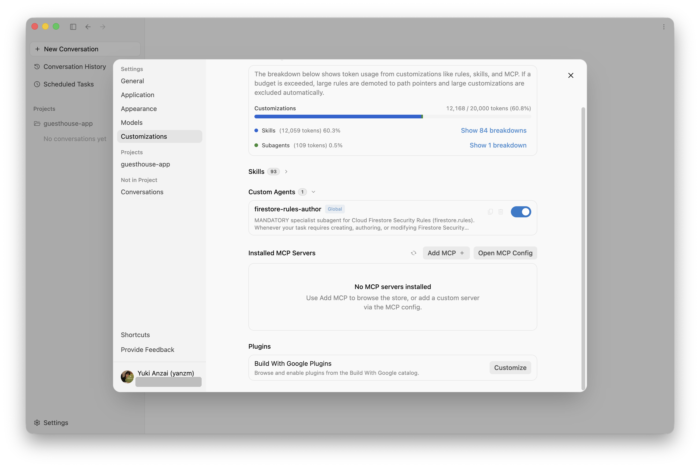

2. **Installed MCP Servers** の **Add MCP +** をクリックすると、MCP ストアが開きます

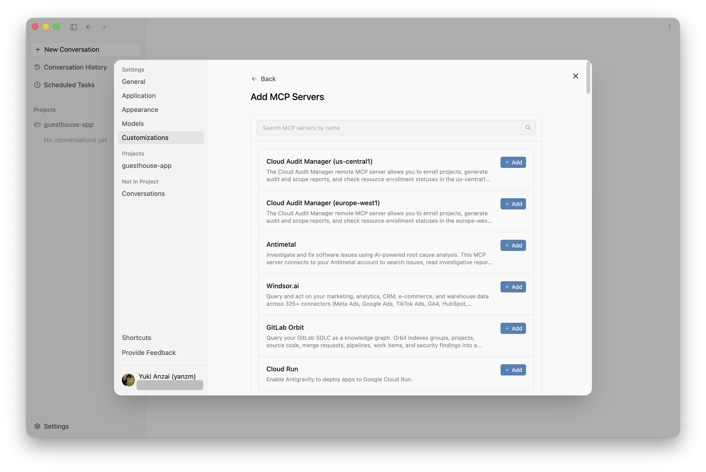

3. 検索欄に **firestore** と入力し、**Google Cloud Firestore** の **+ Add** をクリックします

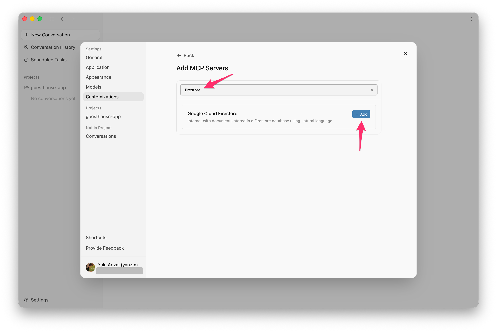

4. 同じように **Cloud Run** を検索して **+ Add** をクリックします

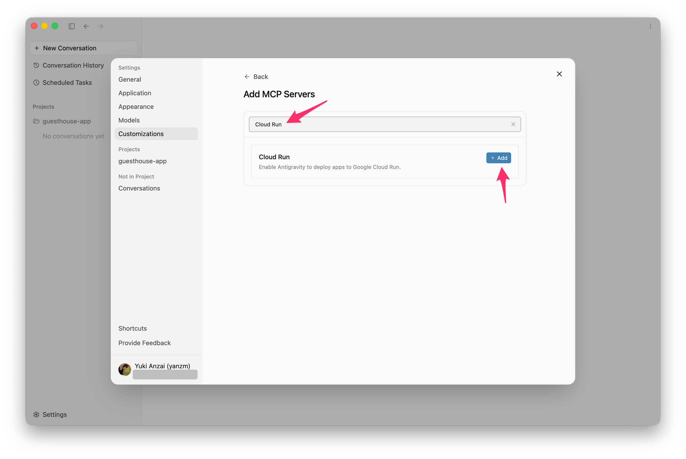

5. Customizations に戻ると、2 つの MCP が有効（緑の ●）になっています。「〜 tools enabled」の部分をクリックすると、エージェントに増えたツールの一覧が見えます。Cloud Run の方に `deploy_local_folder` や `get_service_log`、Firestore の方に `add_document` や `list_documents` があることを確認してください

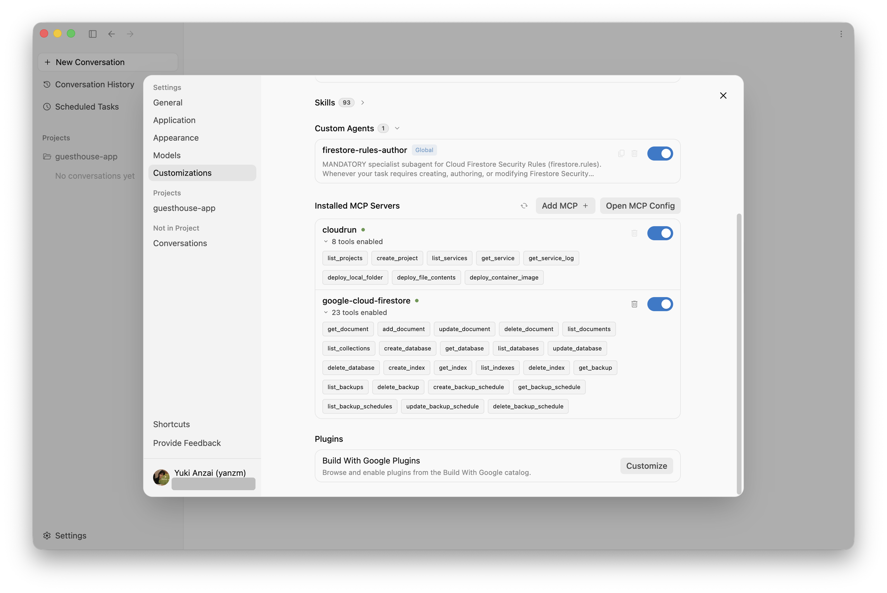

> **Tip** : MCP の設定は `~/.gemini/config/mcp_config.json` に保存されています。**Open MCP Config** ボタンで中身を見られます。Firestore MCP は `"authProviderType": "google_credentials"` となっていて、事前準備で設定した gcloud の認証情報（ADC）がそのまま使われます。

## ステップ 2 : アプリを作る（目安 : 30 分）

### 会話を開始する

左上の **+ New Conversation** をクリックし、会話の対象がさっき作ったプロジェクトになっていることを確認します。

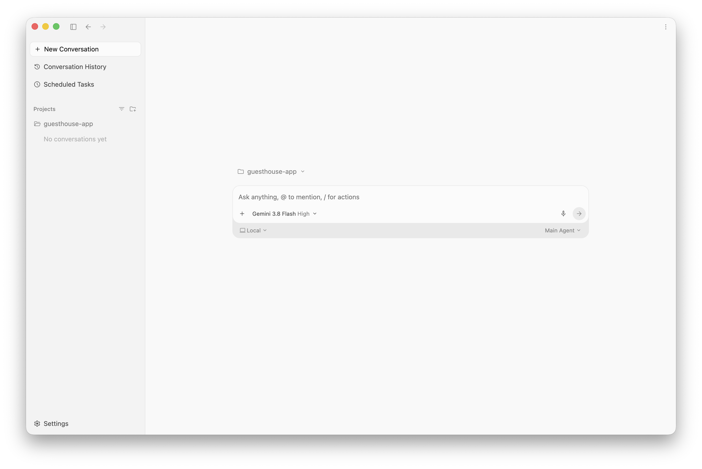

モデルはデフォルトの **Gemini 3.8 Flash (High)** のままで大丈夫です。今日のアプリはこのモデルで十分に作れることを確認済みです。

> **Note** : 最初の依頼では自動的に実装計画（Implementation Plan）が作られ、あなたの承認を待ってから実装に入ります。「計画モード」のような切り替えは不要です。

### エージェントにアプリの作成を依頼する

以下のプロンプトをコピーし、`<PROJECT_ID>` を自分のプロジェクト ID に置き換えて送信します。

```
ゲストハウスの宿泊予約システムを作ってください。

## 機能（この 3 つだけ）
1. 部屋一覧ページ : 部屋の名前・定員・料金を表示
2. 空室確認 : チェックイン日・チェックアウト日を指定すると空いている部屋を表示
3. 予約登録 : 部屋・日付・宿泊者名を指定して予約を作成。既存予約と日程が重なる場合はエラーにする

## 技術要件
- Node.js + Express + EJS テンプレート（フロントエンドフレームワークは使わない）
- データは Google Cloud Firestore に保存（コレクション名 : rooms, reservations）
- rooms のドキュメントは name（文字列）, capacity（整数）, price（整数）のフィールドを持つ
- reservations のドキュメントは room_id, guest_name, check_in, check_out（いずれも文字列）のフィールドを持つ
- `npm start` で起動し、環境変数 PORT があればそのポートで 0.0.0.0 を listen する（デフォルトは 8080）
- Google Cloud プロジェクト ID : <PROJECT_ID>

## 注意
- 管理画面、ログイン、キャンセル機能は不要
- デザインはシンプルで良い
```

**送る前に、このプロンプトが何を頼んでいるか読んでみてください。**

- 機能を **3 つに絞っている**のは、110 分で動くものにたどり着くためです。管理画面やキャンセルは、あとから頼めば足せます
- **Firestore とコレクション名、フィールド名まで指定**しているのは、このあとステップ 3 で MCP から入れるデータと、アプリが読む形を一致させるためです。指定しないと、エージェントは作るたびに違う名前（`checkin`、`check_in`、`checkin_date` …）を付けます。全員が同じ構成になるので、隣の人と見比べたり、15:00 のパートで共通の手順を使ったりできます
- **`PORT` 環境変数で `0.0.0.0` を listen** は Cloud Run の約束事です。Cloud Run はコンテナに `PORT` を渡し、そのポートで待ち受けていることを期待します。ここを書き忘れると、ローカルでは動くのにデプロイ後に起動しない、という典型的な失敗になります

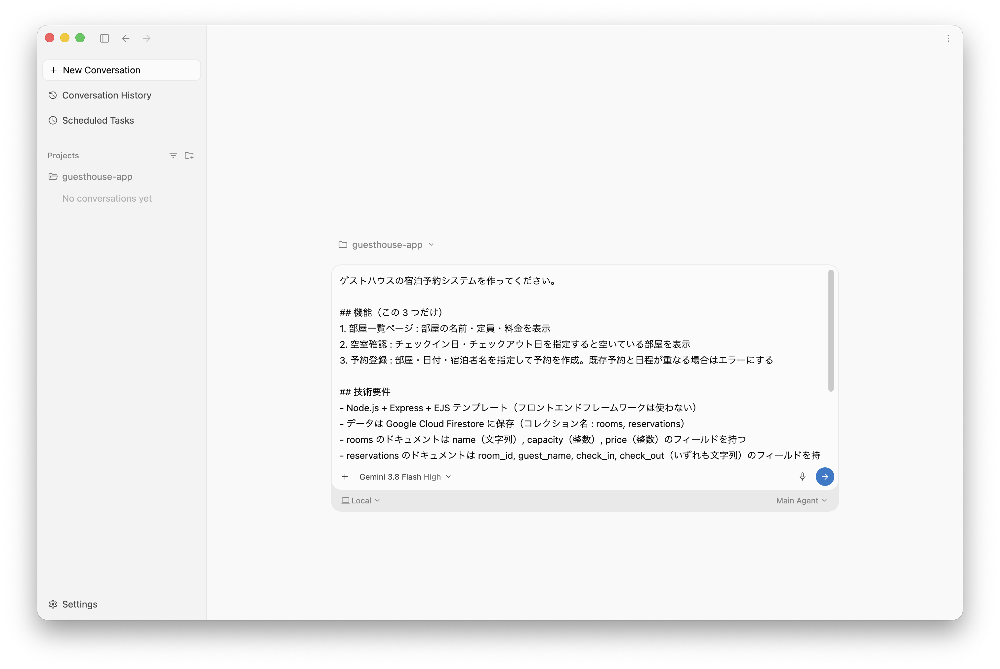

エージェントは、実装の前に **Plan**（実装計画）を書いて右パネルに表示することがあります。表示されたら、技術仕様やデータモデル（`rooms` と `reservations` のフィールド）が頼んだとおりになっているかを見てください。計画を書かずに、そのまま実装に進むこともあります。計画の承認を求められた場合は、内容を確認して進めてください。

実装が終わるまで 2〜3 分かかります。エージェントが何を実行しているか（`ls` でフォルダを見る、ファイルを書く…）が会話に順に表示されるので、眺めてみてください。

### 完成を確認する

実装が終わると、エージェントが作業の報告を表示します。ルールにしたがって `npm install` と動作確認を行っていないこと、次にあなたがやる手順（`npm install` と `npm start`）、変更したファイルの一覧（「9 files changed」など）が書かれています。

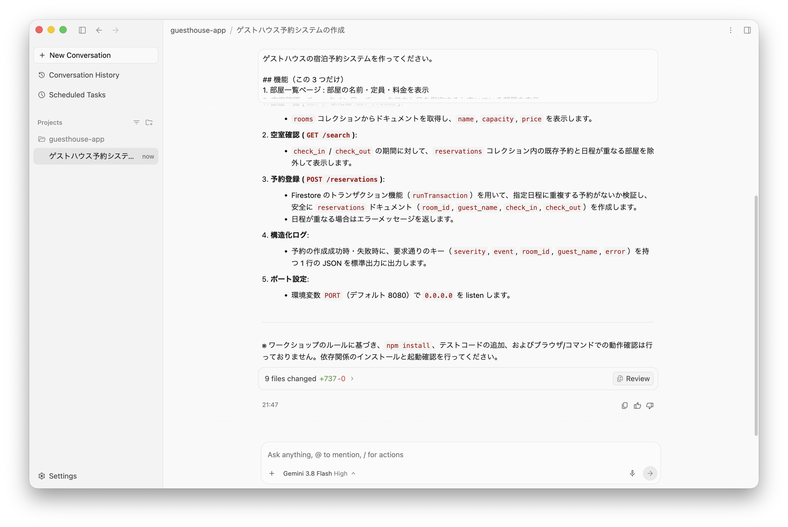

ここからは自分の手で動かします。

**1. `package.json` を見る**

変更したファイルの一覧の **Review** をクリックすると、右パネルに各ファイルの中身が表示されます。`package.json` の `dependencies` を見てください。エージェントが「このアプリに必要」と判断したライブラリと、そのバージョンが書かれています。

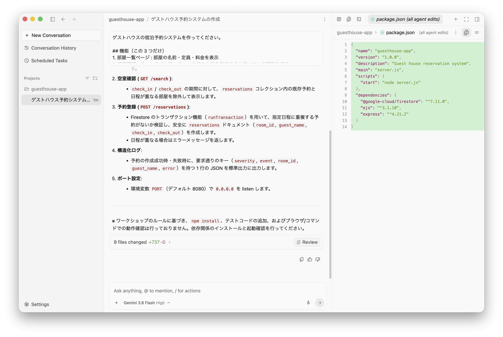

このバージョンは、エージェントが **学習した時点の記憶** で書いたものです。npm のレジストリに「今の最新は何か」を問い合わせてはいません。事前検証では上のようになり、3 つとも古いメジャーバージョンでした（2026 年 10 月時点の最新は firestore 9 系、EJS 6 系、Express 5 系）。

**2. エージェントにバージョンを更新させる**

同じ会話で、次のように頼みます。

```
package.json の dependencies のバージョンが古いようです。
npm view で各ライブラリの最新バージョンを確認して、package.json を更新してください。
変更履歴の調査やコードの修正は、今は行わないでください。npm install は私が実行します。
```

エージェントは `npm view express version` のようなコマンドで、npm のレジストリに最新のバージョンを問い合わせます。ここで、今日はじめての **承認ダイアログ** が出ます。

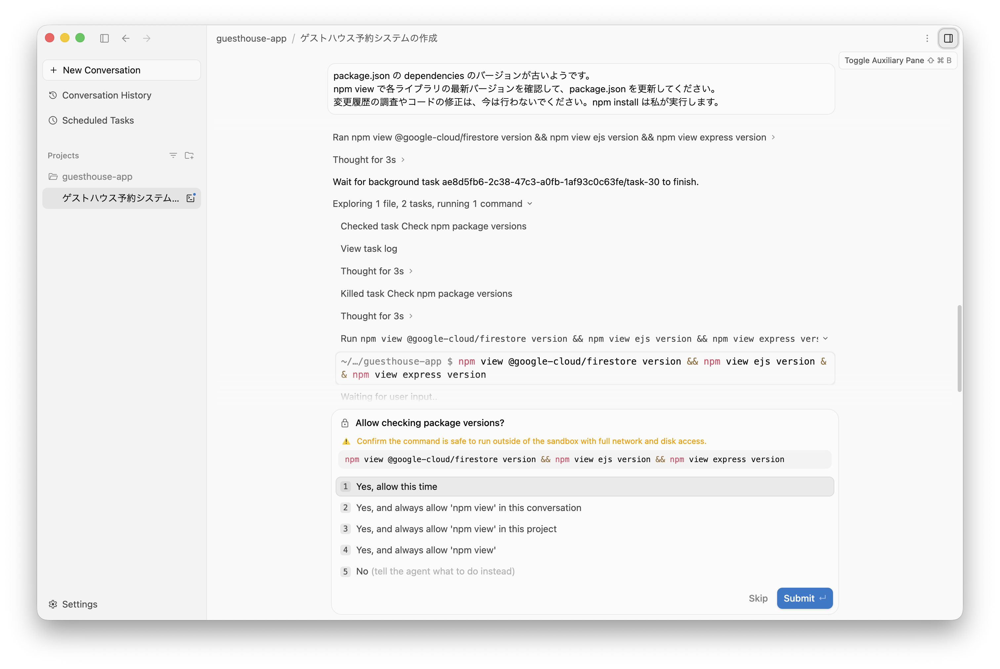

**なぜここで聞かれるのか** : Antigravity 2.0 のエージェントは、ターミナルコマンドを **サンドボックス**（隔離された環境）の中で実行します。サンドボックスからはプロジェクトのフォルダしか見えず、ネットワークにも繋がりません。エージェントが勝手に外部へデータを送ったり、プロジェクトの外のファイルを壊したりしないための仕組みです。アプリを作っている間の `ls` などは、この中で承認なしに動いていました。

`npm view` はネットワークが必要なので、サンドボックスの中では失敗します。そこでエージェントは、サンドボックスの外で実行する許可を求めてきます（失敗するまで 10 秒ほど待つことがあります）。

**ダイアログの読み方** : タイトル（Allow checking latest package versions?）は、エージェントが書いた「何のために実行するか」です。その下が、実際に実行されるコマンドです。承認すると、このコマンドはあなたがターミナルで打つのと同じ権限で動きます。

| 選択肢 | 意味 |
| --- | --- |
| 1 Yes, allow this time | 今回だけ許可する |
| 2 Yes, and always allow ... in this conversation | この会話では、同じコマンドを聞かずに実行する |
| 3 Yes, and always allow ... in this project | このプロジェクトでは、同じコマンドを聞かずに実行する |
| 4 Yes, and always allow ... | どのプロジェクトでも、同じコマンドを聞かずに実行する |
| 5 No | 拒否して、代わりにやってほしいことを書く |

コマンドが `npm view` であることを確かめて、**1 Yes, allow this time** を選んでください。<span style="color:salmon"><b>今日はコマンドの承認では 1 を選び、毎回中身を読むようにしましょう。</b></span>

1 分ほどで終わります。**Review** を開くと、`package.json` のどこが変わったかが差分で見えます。

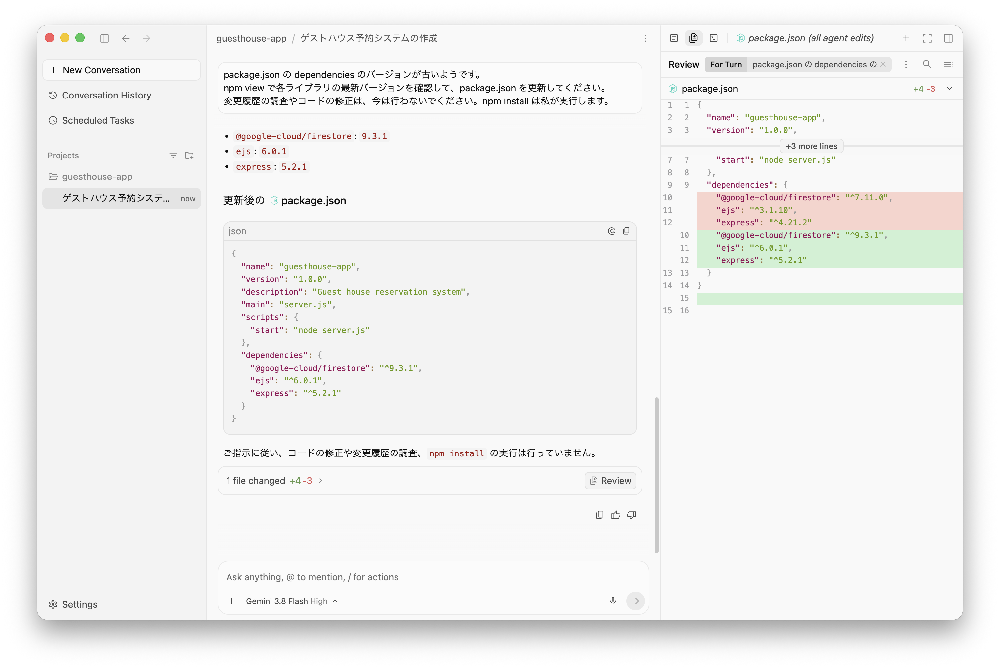

> **なぜ「調査はしないで」と書くのか** : 「新しいバージョンでコードが動くか調べて」と頼むと、エージェントは移行ガイドや変更履歴を Web から次々に読みに行きます。事前検証では、1 回の依頼で 20 回近くコマンドを実行したこともありました。読んだ内容はすべてモデルの利用量になり、承認ダイアログも増えます。動くかどうかは、このあと実際に動かして確かめる方が早くて確実です。

**3. ライブラリをインストールする**

右パネルの **Terminals** で以下を実行します。

```
npm install
```

`package.json` に書かれたライブラリと、それらが依存するライブラリが `node_modules` フォルダに入ります。

`npm warn deprecated ...` という警告が 1〜2 行出ることがあります。これは、ライブラリが内部で使っている別のライブラリが古い、という通知です。最後に `found 0 vulnerabilities`（既知の脆弱性は 0 件）と出ていれば大丈夫です。

**4. サーバーを起動する**

```
npm start
```

`listening on 0.0.0.0:8080` のような表示が出れば起動しています（止めるときは `Ctrl + C`）。

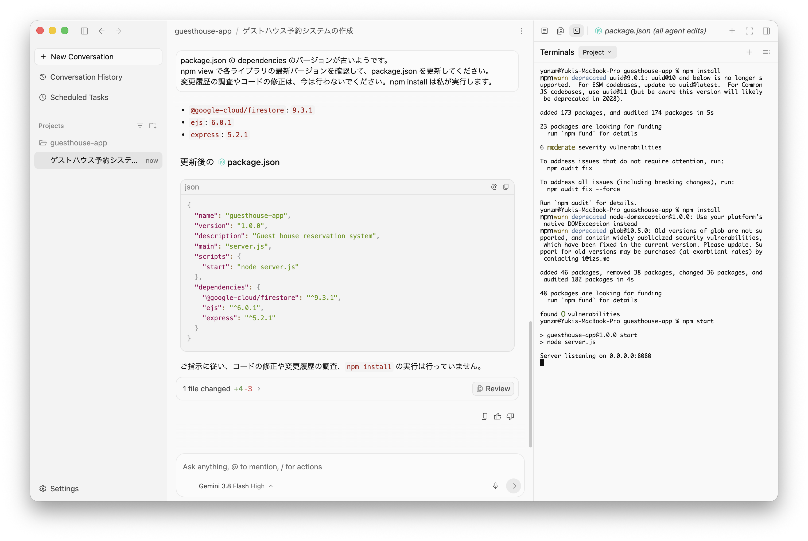

**5. ブラウザで確認する**

http://localhost:8080 を開きます。**部屋一覧が空**で表示されれば成功です。まだデータを入れていないので空で正解です。

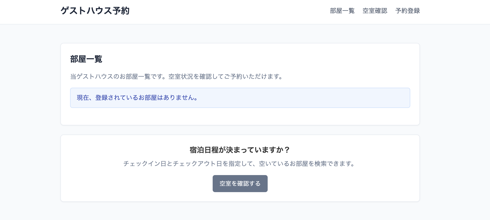

画面のデザインや構成は、生成のたびに少しずつ変わります。上の画像と同じでなくても問題ありません。

バージョンを上げたことで動かなくなった場合は、ターミナルにエラーが出ます。そのときは、エラーの文面をコピーしてエージェントに貼り付け、「このエラーを直してください」と頼んでください。事前検証では、エージェントが書いたコードは最新版のライブラリでそのまま動きました。

## ステップ 3 : Firestore MCP で部屋データを入れる（目安 : 10 分）

いよいよ MCP の出番です。エージェントに Firestore を直接操作させて、部屋データを登録します。

**New Conversation** で新しい会話を始め、以下を送信します。

```
Firestore MCP を使って、rooms コレクションに以下の 4 部屋を登録してください。
ドキュメント ID は括弧内の値を使ってください。

- 男女共用ドミトリー (room-dormitory) : 定員 1 名、1 泊 3500 円
- 和室「さくら」 (room-sakura) : 定員 2 名、1 泊 6000 円
- 洋室「ツイン」 (room-twin) : 定員 2 名、1 泊 6500 円
- ファミリールーム「松」 (room-matsu) : 定員 4 名、1 泊 14000 円

登録後、rooms コレクションの内容を一覧して確認してください。
```

ドキュメント ID を指定しているのは、全員が同じ ID になるようにするためです（あとで「room-sakura に予約を入れて」のように話せます）。

エージェントが Firestore MCP のツールを呼ぼうとすると、**Allow using this MCP tool?** という承認ダイアログが出ます。ステップ 2 のコマンドの承認と形は同じで、今度は「どの MCP のどのツールを呼ぶか」が表示されます。引数は、その上の **Tool arguments** に出ています。

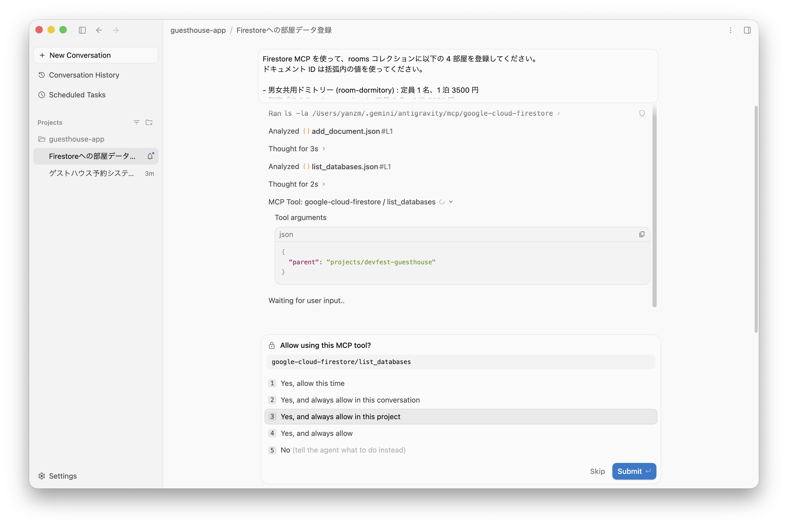

最初に出るのは、`list_databases` や `list_documents` のような **読むだけのツール** です。上の画像は、3 の「このプロジェクトでは常に許可」を選んだところです。選んだら **Submit** を押します。エージェントは書き込む前に、まずデータベースの状態を確かめます。承認は MCP のツールごとに聞かれるので、選び方を決めておきましょう。

| ツールの種類 | 例 | おすすめ |
| --- | --- | --- |
| 読むだけ | `list_databases`, `list_collections`, `list_documents` | **3 Yes, and always allow in this project**。データは変わらないので、このプロジェクトでは聞かれなくてよい |
| 書き込む | `add_document`, `update_document` | 最初の 1 回は引数を読む。内容が合っていれば **2 Yes, and always allow in this conversation**。許可はこの会話の中だけで、次の会話ではまた聞かれる |
| 消す | `delete_document` | 毎回 **1**。何を消すかを読む |

続いて `google-cloud-firestore/add_document` の承認が出ます。Tool arguments を見てみましょう。エージェントが Firestore の API の形式（`integerValue` や `stringValue` の型付き JSON）でドキュメントを組み立てているのが分かります。部屋の名前・定員・料金が頼んだとおりかを確かめてください。合っていれば 2 を選びます。残りの 3 部屋は聞かれずに登録されます。

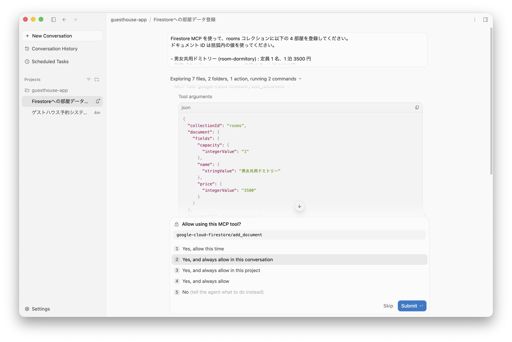

書き込みのツールに 3（このプロジェクトでは常に許可）を選ぶと、今後ほかの会話でも、エージェントが聞かずにデータを書き込めるようになります。書き込みは「何を書くか」を見られる状態を残しておきましょう。

登録が終わると、エージェントが rooms コレクションの内容を表にして見せてくれます。

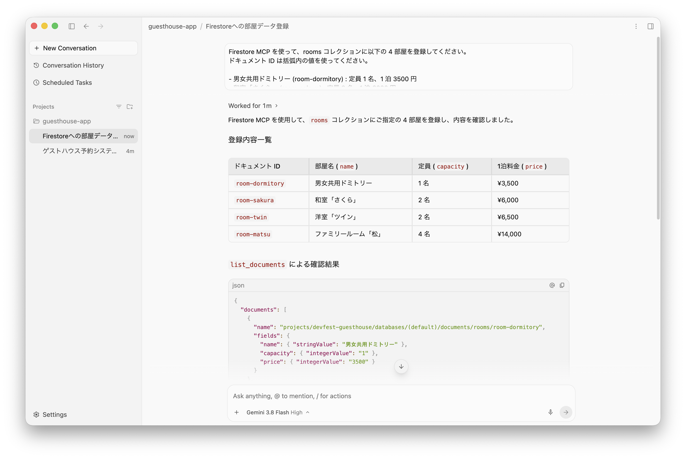

ブラウザをリロードすると、部屋が 4 つ表示されます。

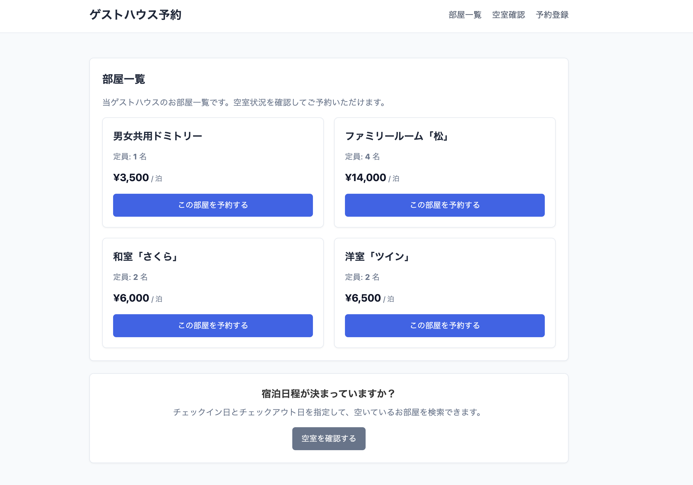

Google Cloud コンソールの Firestore の画面 ( https://console.cloud.google.com/firestore ) でも、同じデータが見えることを確認してみましょう。**エージェントが操作したものが、そのまま本物のデータベースに入っています。**

## ステップ 4 : 予約してみる & ログを見る（目安 : 10 分）

ブラウザで予約を入れてみましょう。画面の作りは生成のたびに少し違いますが、「空室確認」と「予約登録」の 2 つがあるはずです。

<span style="color:salmon"><b>宿泊者名には本名や他人の名前を使わず、「テスト太郎」のようなダミーの名前を使ってください。</b></span> このあとインターネットに公開されます。

**1. 予約を 1 件入れる**

「予約登録」で、部屋・宿泊者名・チェックイン日・チェックアウト日を入れて予約します（例 : 男女共用ドミトリー、テスト太郎、10/10 〜 10/11）。

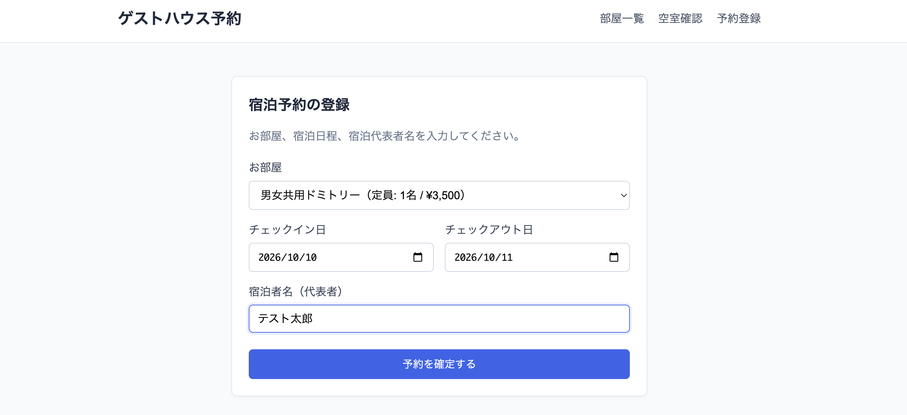

**2. 空室確認で、予約した部屋が消えることを見る**

「空室確認」で、いま予約したのと同じ日程を検索します。予約した部屋が結果に出てこなくなっていれば、空室の判定が動いています。

**3. 同じ部屋・重なる日程で、もう一度予約してエラーを見る**

空室確認の結果には予約済みの部屋が出てこないので、そこからは重ねて予約できません。**「予約登録」のフォームで、部屋の選択肢から同じ部屋を選び**、重なる日程（例 : 10/10 〜 10/12）で予約してください。「すでに予約が入っています」のようなエラーが表示されます。

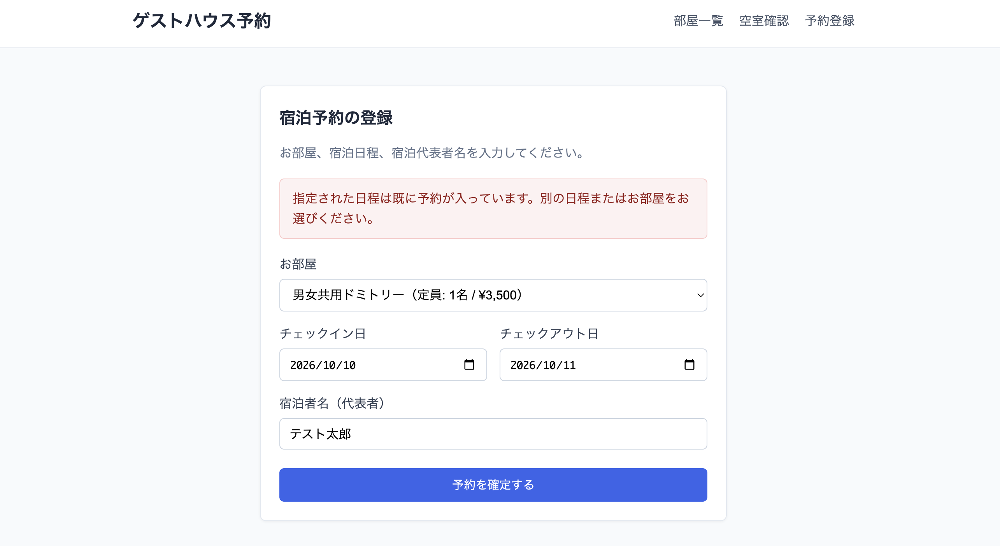

> **Note** : 予約登録のフォームで予約済みの部屋を選べない作りになっていた場合は、ブラウザのタブを 2 つ使います。両方のタブで同じ日程の空室確認の結果を開いておき、片方で予約してから、もう片方で同じ部屋を予約してください。あとから予約した方がエラーになります。実際の予約サイトで「2 人が同時に同じ部屋を予約しようとした」ときに起きるのと同じ状況です。

予約するたびに、右パネルの **Terminals** に次のような 1 行の JSON が流れます。

```
{"severity":"INFO","event":"reservation_created","room_id":"room-dormitory","guest_name":"テスト太郎","error":null}
{"severity":"WARNING","event":"reservation_failed","room_id":"room-dormitory","guest_name":"テスト太郎","error":"指定された日程は既に予約が入っています。別の日程またはお部屋をお選びください。"}
```

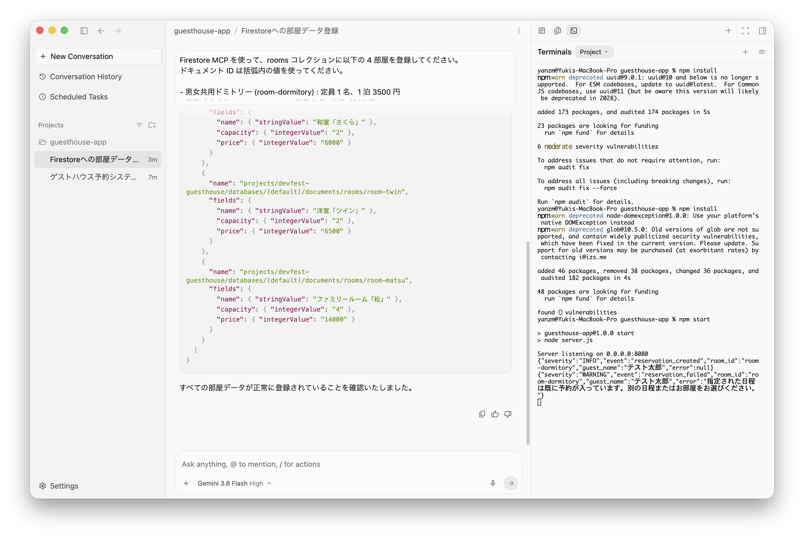

1 行目が予約の成功（INFO）、2 行目が重複で断られた予約（WARNING）です。`event` の値やエラーの文面は、生成のたびに少し違います。

これは **構造化ログ** です。ルールで「JSON 形式で出力して」と指定したので、エージェントがこの形で実装しています。15:00 のパートでは、このログが Cloud Run に載ったあと Google Cloud のログ画面でどう見えるかを確認します。**今ここで見えているものと同じログを、あとで Cloud 側から見る**、と覚えておいてください。

## ステップ 5 : Cloud Run にデプロイする（目安 : 15 分）

**New Conversation** で新しい会話を始め、`<PROJECT_ID>` を置き換えて送信します。

```
このフォルダを Cloud Run MCP を使って Cloud Run にデプロイしてください。
プロジェクト ID : <PROJECT_ID>、リージョン : asia-northeast1、
サービス名 : guesthouse-app、認証なしアクセスを許可してください。
Dockerfile のベースイメージは node:22-slim にしてください。
デプロイ後の動作確認は私が行うので、curl や gcloud は実行しないでください。
```

- **リージョン** は午前に作った Firestore と同じ東京（asia-northeast1）です
- **認証なしアクセスを許可** は「誰でも URL を開ける」にする指定です。これがないと、ブラウザで開いても 403 になります
- **node:22-slim** は Cloud Run の中で使う Node.js のバージョンの指定です。ステップ 2 で入れた @google-cloud/firestore の 9 系は Node.js 22 以上を必要とします。指定しないと、エージェントは記憶にある古いバージョンの Node.js を書くことがあります
- 最後の 1 行の意味は、デプロイが終わったあとの Note で説明します

エージェントは Dockerfile と .dockerignore を自分で作り、`cloudrun/deploy_local_folder` を呼びます。承認ダイアログは **1 回だけ**です。Tool arguments の `project`・`region`・`service` が頼んだとおりかを確かめて、1 を選びます。

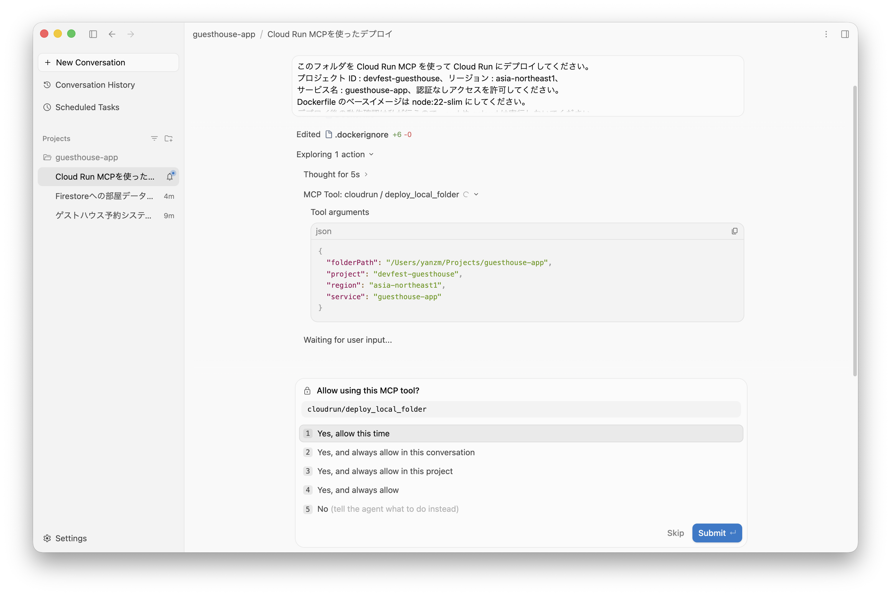

デプロイには 1〜3 分かかります。「デプロイして」の一言の裏で、Cloud Run MCP がこれだけのことを順番にやっています。

1. 必要な Google Cloud の API を有効化する
2. プロジェクトのフォルダをまとめて Google Cloud にアップロードする
3. Dockerfile をもとに、Cloud Build でアプリのコンテナイメージを作る
4. そのイメージで Cloud Run のサービスを作る
5. 誰でもアクセスできるように設定する

15:00 のパートでは、この一つひとつが Google Cloud のコンソール上でどう見えるかを確認していきます。

完了すると **サービス URL** と Cloud Console へのリンクが表示されます。

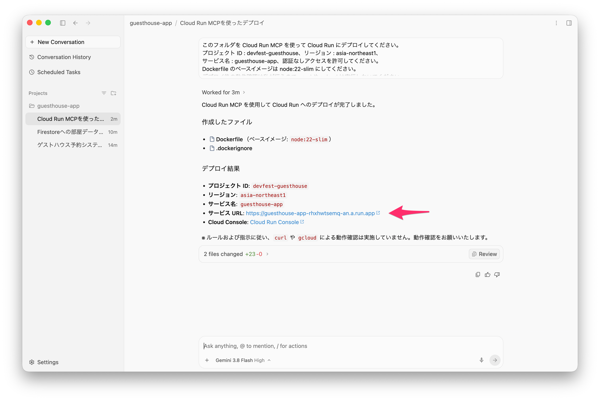

URL をブラウザで開いて、部屋一覧と予約が動くことを確認しましょう。スマホから開いても動きます。<span style="color:salmon"><b>この URL は世界中の誰でもアクセスできます。</b></span>

> **Note** : プロンプトに「デプロイ後の動作確認は私が行うので、curl や gcloud は実行しないでください」と書いてあります。これがないと、エージェントがサンドボックスの中から curl を実行して失敗し、その原因を調べるためにさらにコマンドを走らせ…と承認ダイアログが連発します。「動作確認は人間がやる」と先に伝えておくのがコツです。

**お疲れさまでした！** 予約システムが公開され、データベースに繋がり、ログを吐いています。15:00 のパートでは、これを「運用」していきます。

## ステップ 6 : 時間がある人向け

### 改善のイテレーション

Antigravity 2.0 の得意分野です。新しい会話で、1 回に 1〜2 個ずつ修正を頼んでみましょう。

```
部屋一覧に、各部屋の空き状況が一目で分かるバッジを追加してください。
```

```
予約完了画面に、予約内容（部屋・日程・宿泊者名）を表示してください。
```

修正できたら、ステップ 5 のプロンプトでもう一度デプロイすれば公開されます（デプロイのたびに `node_modules` 込みで 10MB ほどのアップロードが走るので、会場の回線を考えて回数はほどほどに）。

### スラッシュコマンドを使ってみる

入力欄で `/` を打つと、スラッシュコマンドの候補が出ます。続けて名前を打って（`/pla` など）候補から選ぶと、入力欄にコマンドのラベルが入ります。そのあとに依頼を書いて送信します。候補にはスキルも一緒に並ぶので、名前を途中まで打って絞り込むのが早いです。

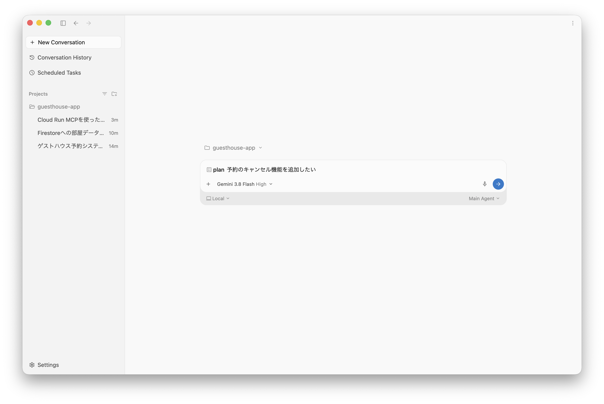

今日の作業で使えるものを 3 つ紹介します。

**`/btw` — 作業を止めずに質問する**

エージェントが作業中でも、割り込まずにバックグラウンドで質問できます。生成されたコードについて聞いてみましょう。`/btw` を選んでから、続けて質問を書きます。

```
Dockerfile の各行は何をしていますか？初心者向けに説明してください
```

```
予約を作成する処理で Firestore のトランザクションを使っているのはなぜですか？
```

**`/plan` — 実装前に計画だけ作らせる**

大きめの変更を頼む前に、コードを書かせずに計画だけ見たいときに使います。`/plan` を選んでから、続けてやりたいことを書きます。

```
予約のキャンセル機能を追加したい
```

エージェントはコードを調べて計画を書き、**Proceed** ボタンを出して止まります。先に方針についていくつか質問してくることもあります。`/plan` では、Proceed を押すまでコードは書かれません。計画を読むだけで終わりにしたいときは、押さずにそのままにします。

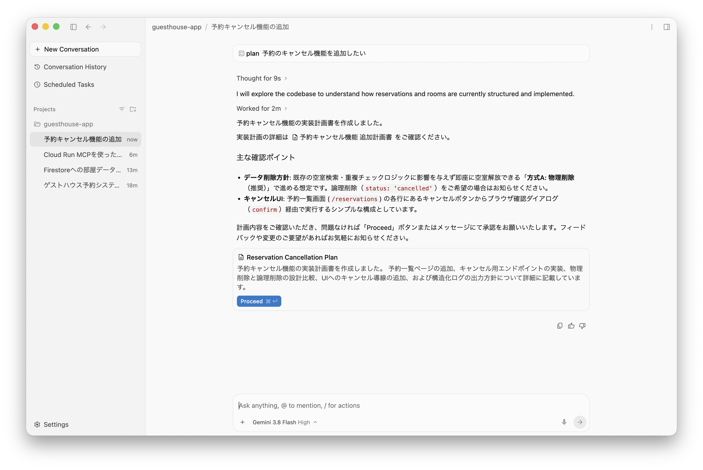

**`/learn` — 今日の学びをルールやスキルに変える**

この会話でのやりとり（うまくいったこと、直したこと）を、次回以降も使える **ルール** や **スキル** に蒸留してくれます。ワークショップの最後にやってみると、今日の体験が自分の資産として残ります。`/learn` を選んでから、続けて次を書きます。

```
今日のゲストハウス予約システムの開発で学んだことを、次に同じようなアプリを作るときに使えるスキルにしてください
```

エージェントは、スキルに入れる内容と保存場所の案（Learning Proposal）を出して止まります。保存場所は 2 つあります。

| 保存場所 | 使われる範囲 |
| --- | --- |
| `.agents/skills/<スキル名>/SKILL.md`（プロジェクトの中） | このプロジェクトだけ |
| `~/.gemini/config/skills/<スキル名>/SKILL.md`（ホームフォルダ） | これから作るすべてのプロジェクト |

希望があれば「プロジェクトの中だけに保存してください」のように伝え、なければそのまま **Proceed** を押します。どこに作られたかは、完了の報告に「作成先」として表示されます。

生成された `SKILL.md` を開いて、エージェントが何を「学び」として抽出したか見てみましょう。ホームフォルダに作られたスキルは、今日のプロジェクトを消しても残り、別のプロジェクトでもエージェントが使います。不要になったらフォルダごと削除してください。

> **Note** : `/goal`（完了まで自律的に走らせる）と `/browser`（ブラウザサブエージェント）もありますが、承認とモデルの利用量を大きく消費するので、今日は使わないでください。詳しくは [Antigravity 2.0 ガイド](antigravity-guide.md#スラッシュコマンド) を参照してください。

### エージェントにログを取らせる

15:00 のパートの予告です。以下を送ると、エージェントが Cloud Run MCP の `get_service_log` でログを取得し、警告があれば要約してくれます。

```
guesthouse-app の直近のログを Cloud Run MCP で取得して、エラーや警告がないか確認してください。
警告があれば、それぞれ何が起きたのかを説明してください。
```

エージェントは `cloudrun/list_services` でサービスを探し、`cloudrun/get_service_log` でログを取得します。どちらも読むだけのツールです。

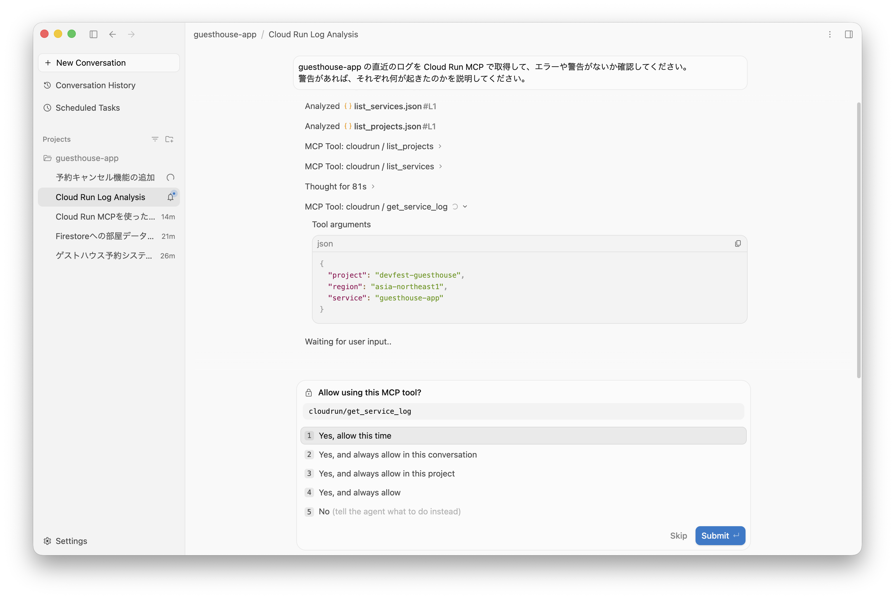

結果を見ると、ステップ 4 と同じ重複予約を公開 URL で試したときの警告が見つかっています。ただし、ログの中身は `[object Object]` になっています。Cloud Run MCP はまだ構造化ログをうまく読めません。そのためエージェントは server.js を読んで「予約が失敗した」ことまでは突き止めますが、理由は候補を並べるだけで、どれだったのかは特定できていません。

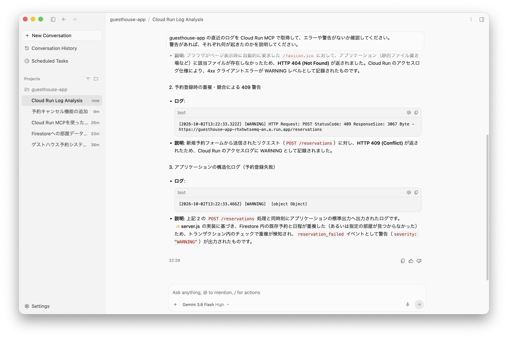

これは Cloud Run MCP の `get_service_log` の制約です。ログ専用の **Cloud Logging MCP** なら、構造化ログの中身（`room_id`・`guest_name`・`error`）まで読めます。**同じログでも、エージェントに持たせる道具によって見えるものが変わります。**

試してみる場合は、ステップ 1 と同じ手順で MCP ストアから **Cloud Logging** を Add し、新しい会話で次を送ります。

```
Cloud Logging MCP で、guesthouse-app の WARNING 以上のログを取得して、それぞれ何が起きたのかを説明してください。
プロジェクト ID : <PROJECT_ID>
```

Google Cloud コンソールのログ画面で人間が見るとどう見えるかは、15:00 のパートで確かめてみましょう。

## 15:00 のパートに向けて

以下は閉じずに残しておいてください。

- Antigravity 2.0（MCP が入った状態）
- デプロイした **サービス URL**
- 自分の **プロジェクト ID**

<span style="color:salmon"><b>クリーンアップ（プロジェクトの削除）は 16:30 の発表が終わってから行います。</b></span> 今は消さないでください。

## 困ったときは

### エラーが起きたら「新しい会話」

エージェントは失敗すると、原因を突き止めようとしていろいろなコマンドを実行し始めます。検証中に実際に起きたのは、Firestore の権限エラーの後に `gcloud auth list` → `gcloud projects list` → アクセストークンを取り出して curl で送信 → **`~/.zsh_history`（シェルの履歴）を読む** という流れでした。

こうなったら承認ダイアログで **No**（5 番）を選び、その会話は捨てて **New Conversation** でやり直してください。原因が分かっているなら（「ロールが足りなかった、付けたので再実行して」など）、新しい会話でそれを伝えるのが最短です。

### よくある症状

| 症状 | 原因 | 対処 |
| --- | --- | --- |
| 入力欄の横に「⚠ MCP Error」、`sending "tools/call": Forbidden` | `roles/mcp.toolUser` が付いていない | 午前の手順で IAM ロールを付与する。オーナーでもこのロールは必要 |
| デプロイで `PERMISSION_DENIED: Cloud Resource Manager API has not been used in project ...` | Cloud Resource Manager API が有効になっていない | Terminals で `gcloud services enable cloudresourcemanager.googleapis.com` を実行し、1 分ほど待ってから「API を有効化しました。もう一度デプロイしてください」と伝える（[setup-gcp.md の 6](setup-gcp.md#6-午後に使う-api-を有効化する当日)） |
| デプロイで `Error deploying folder to Cloud Run: ... Premature close` | Node.js 22.23.0 / 24.17.0 の不具合 | Node を更新して **Antigravity を再起動**。スタッフに声をかけてください |
| 「依存パッケージのインストールを待機しています」のまま何分も進まない | ルールが効かず、エージェントが `npm install` をサンドボックスの中で実行している | 入力欄の上の実行中タスクを停止し、「npm install は私が実行します。実装を続けてください」と伝える |
| 承認ダイアログが連発する | エージェントが原因調査を始めた | **No** を選んで、新しい会話でやり直す |
| 「Allow read access to this path?」で、プロジェクトフォルダの外のパスが表示される | エージェントがプロジェクトの外（1 つ上のフォルダなど）のファイルを読もうとしている | **No** を選ぶ。プロジェクトを他のファイルがある場所の中に作っていると起きやすい |
| 「Failed to send」と表示される | ログインの問題 | 一度ログアウトして再ログイン |

### 「always allow」は慎重に

承認ダイアログで **2〜4（always allow）** を選ぶと、その操作はプロジェクトの許可リストに保存され、次からはダイアログなしで実行されます。<span style="color:salmon"><b>調査モードに入ったエージェントが出してくるコマンド（`gcloud auth` や `curl` など）に always allow を選ぶと、それ以降は止められません。</b></span> always allow は、中身を読んで「毎回許可してよい」と判断できるもの（今日なら Firestore MCP や Cloud Run MCP のツール）だけにしてください。Settings のプロジェクト設定にある **Permission Preset**（business account では **Security Preset**）を **Turbo**（承認なし・サンドボックスなしで実行）にするのも同じ理由で NG です。詳しくは [Antigravity 2.0 ガイド](antigravity-guide.md#権限エージェントに何を許すか) を参照してください。

## 開発のコツ

エージェントが使ったモデルの利用料は、使った分だけクレジットから支払われます。無駄な利用を減らすコツは、そのままエージェントとうまく付き合うコツでもあります。

- **モデルは Flash のまま** : 今日のアプリは Gemini 3.8 Flash (High) で十分です。Pro は計画や難しい修正のときだけ
- **見た目の確認は人間の目で** : 「プレビューを見て確認して」と頼むと、画像解析でモデルの利用量が大きくなります。自分で見て言葉で伝えましょう
- **エラーは貼り付ける** : 「動かないから調べて」ではなく、ターミナルのエラーをコピーして貼る
- **1 回の依頼は 1〜2 個** : 大量の修正を一度に頼むより、細かくキャッチボールする方が正確です
- **失敗したら新しい会話** : 同じ会話で続けると、エージェントの調査に承認とモデルの利用量を消費します

## クリーンアップ（発表が終わってから）

今日のクレジットは、取得から 6 時間で失効します。作ったリソース（Cloud Run のサービス、Artifact Registry のコンテナイメージ、Cloud Storage のソース zip など）を残さないように、**プロジェクトごと削除**します。

1. Google Cloud コンソールで **[IAM と管理]** > **[リソースの管理]** を開く
2. 今日のプロジェクトを選択し、**[削除]** をクリック
3. プロジェクト ID を入力して確認

または、ターミナルで :

```
gcloud projects delete <プロジェクトID>
```

> **Note** : プロジェクトの削除は 30 日間の猶予期間があり、その間は復元できます。ただし **Cloud Run のサービスと課金アカウントのリンクは復元されません**。復元して使い続けたい場合は、`gcloud projects undelete` のあと、自分の課金アカウントを紐付ける必要があります。

## 今日体験したこと

- **ルールでエージェントの行動を先回りして制御する** : 「やってほしくないこと」を先に伝えると、承認ダイアログもモデルの利用量も減る
- **MCP でエージェントに「手」を持たせる** : Firestore の読み書きも Cloud Run へのデプロイも、エージェントが直接やった
- **承認ダイアログを読む** : エージェントが何をしようとしているかを毎回確認する。失敗したときの「調査モード」の危うさも見た
- **本物のデータベースとログを持つシステムを公開した** : 15:00 からはこれを運用する

## 参考資料

- [Antigravity 2.0 ガイド](antigravity-guide.md) : 画面構成・設定・MCP の詳細
- Antigravity 公式ドキュメント : https://antigravity.google/docs
- Cloud Run MCP（GitHub） : https://github.com/GoogleCloudPlatform/cloud-run-mcp
- Firestore MCP（公式ドキュメント） : https://docs.cloud.google.com/firestore/native/docs/use-firestore-mcp
