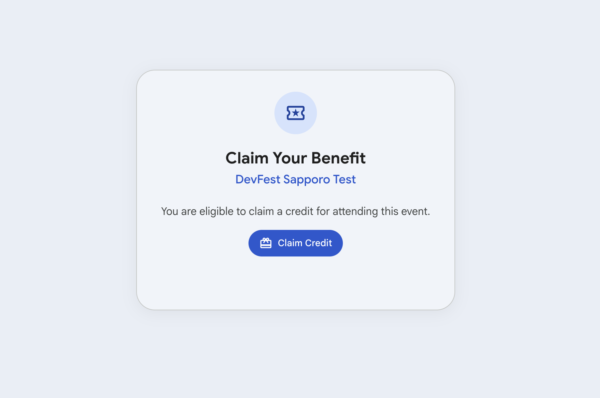
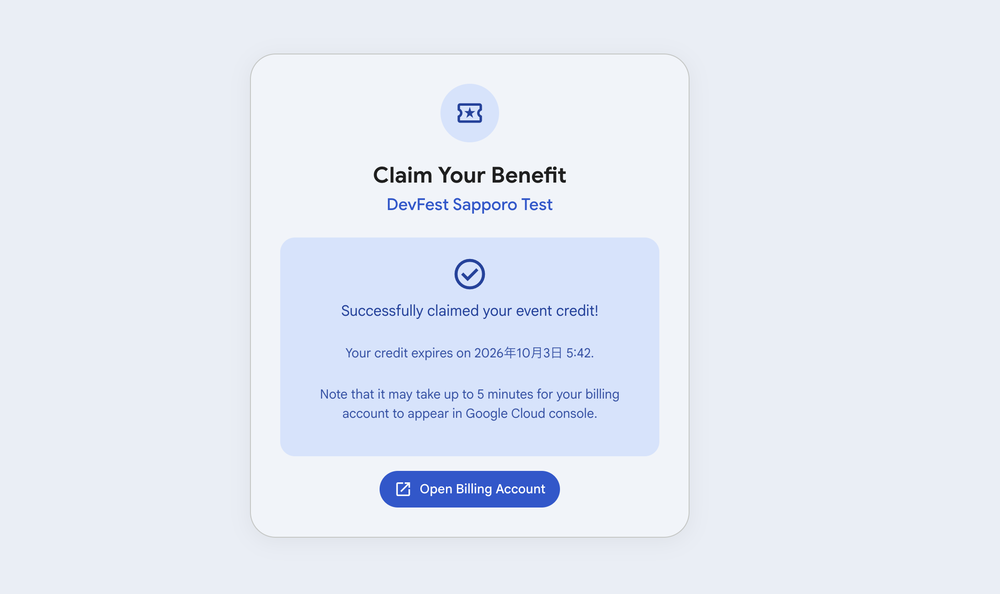
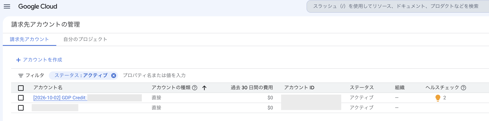
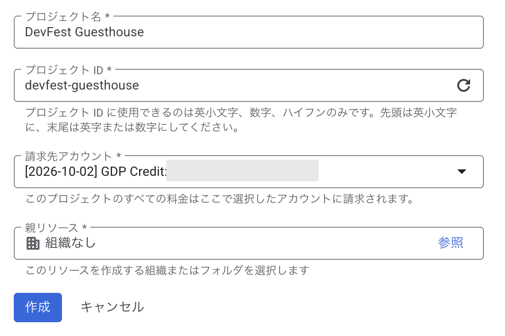

# Google Cloud のセットアップ

ワークショップで使う Google Cloud 側の準備です。**当日の午前（11:05-12:00）に、講師の説明を聞きながら自分の手で 1 つずつ進めます。** 各ステップに「何をしているのか」を書いてあるので、当日はそれを理解しながら実行してください。

事前にやってきてほしいのは、当日やると待ち時間が発生する「0. 事前準備」だけです。

<span style="color:salmon"><b>※ 会社や学校の Google Workspace アカウントではなく、個人の Google アカウント（@gmail.com）で行ってください。</b></span>

---

## 0. 事前準備（当日までに）

| 準備 | なぜ事前か |
| --- | --- |
| **gcloud CLI のインストール** | ダウンロードが大きく、会場の回線では時間がかかる |
| **Node.js**（22.23.1 以降 or 24.18 以降） | 同上。Cloud Run MCP とアプリ本体の両方で使います |

当日は **スマートフォン** も持ってきてください。ワークショップ用クレジットの取得で、QR コードを使った確認があります。クレジットカードの登録は不要です。

### gcloud CLI

https://cloud.google.com/sdk/docs/install にしたがってインストールしてください。ログインは当日一緒にやるので不要です（先にやっておいても構いません）。

### 確認

```
gcloud version
node -v
```

<span style="color:salmon">Node.js が 22.23.0 または 24.17.0 だった場合は、別のバージョンに更新してください</span>（Node 本体の不具合で、午後のデプロイが必ず失敗します）。

---

## 1. ワークショップ用のクレジットを取得する（当日）

今日使う Google Cloud の費用は、ワークショップ用のクレジットから支払います。

1. クレジットの申請用 URL をブラウザで開き、個人の Google アカウントでログインします

   https://me.developers.google.com/benefits/claim/devfest-sapporo-2026
2. **Claim Credit** をクリックします。スマートフォンで QR コードを読み取る確認があるので、画面の指示にしたがってください

   

3. 「Successfully claimed your event credit!」と表示されたら取得完了です

   

4. **Open Billing Account** をクリックすると、Google Cloud コンソールの「請求先アカウントの管理」が開きます。一覧に **GDP Credit: …** という名前のアカウントが出るまで待ちます。<span style="color:salmon">出るまで数分かかります。</span>出ていないときは、少し待ってページを再読み込みしてください

   

（画像はテスト用のクレジットで撮ったものです。イベント名と失効の日時は当日の画面と異なります）

**何をしているか** :

- Google Cloud のほとんどのサービスは、無料枠の範囲内であっても **課金アカウント**（費用の支払い元。コンソールでは「請求先アカウント」と表示されます）の紐付けが必須です。クレジットを取得すると、クレジットが入った課金アカウントが自分用に 1 つ作られます。これが GDP Credit です
- <span style="color:salmon">クレジットを取得できるのは 11:00〜15:00 の間だけです。</span>取得から 6 時間で失効するので、今日のワークショップ専用です

---

## 2. プロジェクトを作る（当日）

ブラウザで https://console.cloud.google.com/projectcreate を開き、新しいプロジェクトを作ります。

1. **プロジェクト名** : 任意の名前を入力します（例 : `DevFest Guesthouse`）
2. **プロジェクト ID** : 名前をもとに自動で入ります。自分で書き換えることもできます。世界中で一意である必要があり、使えるのは英小文字・数字・ハイフンのみ、6〜30 文字です。<span style="color:salmon">あとから変更できません。このあと何度も使うので、メモしておいてください</span>
3. **請求先アカウント** : 1 で一覧に出てきた **GDP Credit: …** を選びます
4. **親リソース** : 「組織なし」のままにします
5. **作成** をクリックします



**何をしているか** :

- **プロジェクト**は Google Cloud のリソース（データベース、サーバー、ログ…）をまとめる箱です。今日作るものは全部この箱に入り、最後に箱ごと削除します
- **請求先アカウント**に GDP Credit を選ぶことで、このプロジェクトで発生する費用がクレジットから支払われます
- <span style="color:salmon">クレジットを取得したら、15:00 までにプロジェクトを作る必要があります。</span>作らないとクレジットが失効します

> **Note** : すでに自分の課金アカウントを持っている方も、今日は GDP Credit を選んでください。午後は Antigravity のモデルの利用料もこのプロジェクトから支払うので、自分の課金アカウントを選ぶと実際に請求が発生します。

---

## 3. gcloud にログインする（当日）

ターミナルで以下を **両方** 実行します。どちらもブラウザが開くので、クレジットを取得したのと同じ Google アカウントでログインしてください。

```
gcloud auth login
```

```
gcloud auth application-default login
```

続けて、2 で作ったプロジェクトを指定します。

```
gcloud config set project <プロジェクトID>
```

**何をしているか** : 2 つのログインは別物です。

| コマンド | 誰のための認証か |
| --- | --- |
| `gcloud auth login` | **gcloud コマンド自体**が使う（このあと打つコマンドのため） |
| `gcloud auth application-default login` | **あなたが書いたプログラムや、エージェントのツール**が Google Cloud にアクセスするときに使う（ADC = [Application Default Credentials](https://docs.cloud.google.com/docs/authentication/application-default-credentials)） |

午後は、エージェントが作ったアプリと MCP の両方が ADC を使って Firestore や Cloud Run に繋がります。片方だけやって「認証したのに繋がらない」となるのが定番の詰まりポイントです。
2つのコマンドを同時に実行することもできます。 `gcloud auth login --update-adc` で同時に認証を行うことができます。

`config set project` は「これ以降の gcloud コマンドはこのプロジェクトに対して実行する」という設定です。

---

## 4. ADC にプロジェクトを教える（当日）

```
gcloud auth application-default set-quota-project <プロジェクトID>
```

**何をしているか** : ADC には、どのプロジェクトの利用枠（quota）を使うかを別に教える必要があります。3 の `config set project` は gcloud コマンド用の設定で、ADC には伝わりません。

> **Note** : 以前に別のプロジェクトで gcloud を使ったことがある方は、3 の `config set project` で「Your active project does not match the quota project in your local Application Default Credentials file.」という警告が出ます。このコマンドを実行すれば解消します。

---

## 5. Firestore データベースを作る（当日）

```
gcloud services enable firestore.googleapis.com
gcloud firestore databases create --database="(default)" --location=asia-northeast1 --type=firestore-native
```

1 分ほどかかります。

**何をしているか** :

- 1 行目は「このプロジェクトで Firestore の API を使えるようにする」です。Google Cloud のサービスは、使う前にプロジェクトごとに API を有効化する必要があります
- 2 行目がデータベースの作成です。午後に作る予約システムのデータ（部屋・予約）はここに入ります
- **`asia-northeast1`（東京）** はデータの置き場所です。<span style="color:salmon">後から変更できません</span>。午後の手順は全員がこのリージョンである前提で書かれています
- **Native mode** は Firestore の 2 つのモードのうちの 1 つです。もう 1 つの Datastore mode を選ぶと API が別物になり、午後の手順が動きません

https://console.cloud.google.com/firestore を開いて、空のデータベースが見えることを確認してください。午後、エージェントがここにデータを入れるのを目で見ることになります。

---

## 6. 午後に使う API を有効化する（当日）

```
gcloud services enable aiplatform.googleapis.com
gcloud services enable cloudresourcemanager.googleapis.com
```

**何をしているか** : どちらも、午後に Antigravity から使う API です。

- **Agent Platform API**（1 行目）: Agent Platform（旧 Vertex AI）は、Google Cloud からモデルを呼び出すためのサービスです。午後は Antigravity 2.0 にこのプロジェクトでログインし、エージェントがこの API を通してモデルを使います。<span style="color:salmon">有効になっていないと、最初の依頼が `Agent Platform API has not been used in project ...` で失敗します</span>
- **Cloud Resource Manager API**（2 行目）: プロジェクトそのものの情報（プロジェクト番号など）を調べるための API です。午後に使う Cloud Run MCP は、デプロイのときにアプリのファイルを Cloud Storage のバケットにアップロードします。その前に「このバケットは本当に自分のプロジェクトのものか」を確かめるために、この API でプロジェクト番号を調べます。<span style="color:salmon">有効になっていないと、デプロイが `PERMISSION_DENIED: Cloud Resource Manager API has not been used in project ...` で失敗します</span>

Cloud Run MCP は、デプロイに必要なほかの API（Cloud Build や Artifact Registry など）は自分で有効化してくれます。Cloud Resource Manager API だけは有効化してくれないので、先に手で有効化しておきます（v1.11.0 時点）。

---

## 7. 自分にロールを付ける（当日）

```
gcloud projects add-iam-policy-binding <プロジェクトID> --member="user:<自分のGmailアドレス>" --role="roles/mcp.toolUser"
gcloud projects add-iam-policy-binding <プロジェクトID> --member="user:<自分のGmailアドレス>" --role="roles/datastore.user"
```

**何をしているか** :

- Google Cloud では「誰が何をしてよいか」を **IAM** で管理します。自分が作ったプロジェクトでは自分が **オーナー** になっていて、ほとんどのことができます
- ただし **`roles/mcp.toolUser`** はオーナーでも別に必要です。これは「Google がホストする MCP サーバーのツールを呼んでよい」という権限で、午後に Antigravity のエージェントが Firestore MCP を使うために要ります。<span style="color:salmon">これがないと `Forbidden` エラーになります</span>（事前検証で実際に確認しました）
- `roles/datastore.user` は Firestore のデータを読み書きする権限です

---

## 8. 確認（当日）

以下を実行して、すべて期待通りなら午後の準備完了です。

| コマンド | 期待する結果 |
| --- | --- |
| `gcloud config get-value project` | 自分のプロジェクト ID |
| `gcloud billing projects describe $(gcloud config get-value project)` | `billingEnabled: true` |
| `gcloud auth application-default print-access-token` | `ya29.` で始まる長い文字列 |
| `gcloud firestore databases list` | `(default)` と `asia-northeast1` を含む行 |
| `gcloud services list --enabled --filter="config.name:(aiplatform OR cloudresourcemanager)"` | `aiplatform.googleapis.com` と `cloudresourcemanager.googleapis.com` の 2 行 |
| 下の IAM 確認コマンド | `roles/mcp.toolUser` と `roles/datastore.user` を含む |

```
gcloud projects get-iam-policy $(gcloud config get-value project) --flatten="bindings[].members" --filter="bindings.members:$(gcloud config get-value account)" --format="value(bindings.role)"
```

うまくいかない人は昼休憩中にスタッフが対応します。声をかけてください。

---

## 費用について

今日使う Google Cloud の費用は、1 で取得したクレジットから支払われます。Cloud Run・Firestore・Cloud Build・Artifact Registry と、午後に Antigravity が使うモデルの利用料が対象です。クレジットカードの登録は不要です。

クレジットは取得から 6 時間で失効します。作ったものを残さないように、**ワークショップの最後にプロジェクトごと削除します**。

## 困ったときは

| 症状 | 対処 |
| --- | --- |
| プロジェクト作成の画面で、請求先アカウントに GDP Credit が出てこない | クレジットの取得から数分かかる。1 の 4 の一覧に出てから、プロジェクト作成のページを再読み込みする |
| 8 の確認で `billingEnabled: false` | プロジェクトに課金アカウントが紐付いていない。`gcloud billing accounts list` で GDP Credit の `ACCOUNT_ID` を調べ、`gcloud billing projects link <プロジェクトID> --billing-account=<ACCOUNT_ID>` を実行する |
| `firestore databases create` で「API が有効ではない」 | `gcloud services enable firestore.googleapis.com` をもう一度実行して 1 分待つ |
| 午後の最初の依頼で `Agent Platform API has not been used in project ...` | 「6. 午後に使う API を有効化する」の 1 行目を実行して、1 分ほど待ってから Retry を押す |
| 午後のデプロイで `Cloud Resource Manager API has not been used in project ...` | 「6. 午後に使う API を有効化する」の 2 行目を実行して、1 分ほど待ってからもう一度デプロイを頼む |
| `print-access-token` で「credentials not found」 | `gcloud auth application-default login` をやり直す |
